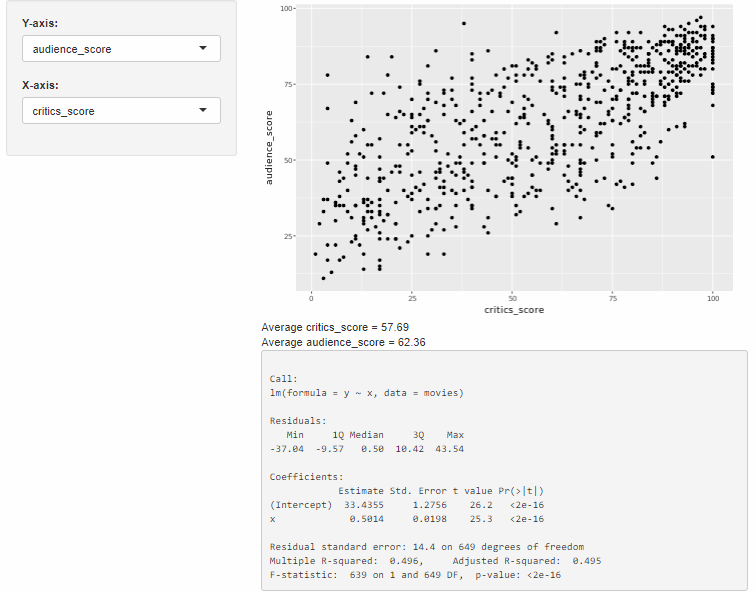

## Reactive Flow

Suppose you have a `slinderInput`in your app with the `inputId="alpha"`. The value of this input is stored in `input$alpha` so when the user moves around the slider the value of the `alpha`input is updated in th einput list. Reactivity automatically occurs when an input value is used to render an output object.

```r
library(shiny)
library(ggplot2)
load(url("http://s3.amazonaws.com/assets.datacamp.com/production/course_4850/datasets/movies.Rdata"))

# Define UI for application that plots features of movies
ui <- fluidPage(
  
  # Sidebar layout with a input and output definitions
  sidebarLayout(
    
    # Inputs
    sidebarPanel(
      
      # Select variable for y-axis
      selectInput(inputId = "y", 
                  label = "Y-axis:",
                  choices = c("imdb_rating", "imdb_num_votes", "critics_score", "audience_score", "runtime"), 
                  selected = "audience_score"),
      
      # Select variable for x-axis
      selectInput(inputId = "x", 
                  label = "X-axis:",
                  choices = c("imdb_rating", "imdb_num_votes", "critics_score", "audience_score", "runtime"), 
                  selected = "critics_score"),
      
      # Set alpha level
      sliderInput(inputId = "alpha", 
                  label = "Alpha:", 
                  min = 0, max = 1, 
                  value = 0.5)
    ),
    
    # Outputs
    mainPanel(
      plotOutput(outputId = "scatterplot")
    )
  )
)

# Define server function required to create the scatterplot
server <- function(input, output) {
  
  # Create scatterplot object the plotOutput function is expecting
  output$scatterplot <- renderPlot({
    ggplot(data = movies, aes_string(x = input$x, y = input$y)) +
      geom_point(alpha = input$alpha)
  })
}

# Create the Shiny app object
shinyApp(ui = ui, server = server)
```

```r
library(shiny)
library(ggplot2)
load(url("http://s3.amazonaws.com/assets.datacamp.com/production/course_4850/datasets/movies.Rdata"))

# Define UI for application that plots features of movies
ui <- fluidPage(

  # Sidebar layout with a input and output definitions
  sidebarLayout(

    # Inputs
    sidebarPanel(

      # Select variable for y-axis
      selectInput(inputId = "y",
                  label = "Y-axis:",
                  choices = c("imdb_rating", "imdb_num_votes", "critics_score", "audience_score", "runtime"),
                  selected = "audience_score"),

      # Select variable for x-axis
      selectInput(inputId = "x",
                  label = "X-axis:",
                  choices = c("imdb_rating", "imdb_num_votes", "critics_score", "audience_score", "runtime"),
                  selected = "critics_score")
    ),

    # Outputs
    mainPanel(
      plotOutput(outputId = "scatterplot"),
      plotOutput(outputId = "densityplot", height = 200)
    )
  )
)

# Define server function required to create the scatterplot
server <- function(input, output) {

  # Create scatterplot
  output$scatterplot <- renderPlot({
    ggplot(data = movies, aes_string(x = input$x, y = input$y)) +
      geom_point()
  })

  # Create densityplot
  output$densityplot <- renderPlot({
    ggplot(data = movies, aes_string(x = input$x)) +
      geom_density()
  })

}

# Create the Shiny app object
shinyApp(ui = ui, server = server)
```

## UI Inputs

Shiny provides a wide selection of input widgets:

### **`checkboxInput`**
Add a checkbox input to specify whether the data plotted should be shown in a data table.

1. **UI**: Add an input widget that the user can interact with to check/uncheck the box
2. **UI**: Add an output defining where the data table should appear
3. **Server**: Add a reactive expression that creates the data table *if* the checkbox is checked

```r
library(shiny)
library(dplyr)
library(DT)

load(url("http://s3.amazonaws.com/assets.datacamp.com/production/course_4850/datasets/movies.Rdata"))

n_total <- nrow(movies)

# Define UI for application that plots features of movies
ui <- fluidPage(
  
  # Sidebar layout with a input and output definitions
  sidebarLayout(
    
    # Inputs
    sidebarPanel(
      
      # Text instructions
      HTML(paste("Enter a value between 1 and", n_total)),
      
      # Numeric input for sample size
      numericInput(inputId = "n",
                   label = "Sample size:",
                   min = 1,
                   max = n_total,
                   value = 30,
                   step = 1)
      
    ),
    
    # Output: Show data table
    mainPanel(
      DT::dataTableOutput(outputId = "moviestable")
    )
  )
)

# Define server function required to create the scatterplot
server <- function(input, output) {
  
  # Create data table
  output$moviestable <- DT::renderDataTable({
    req(input$n)
    movies_sample <- movies %>%
      sample_n(input$n) %>%
      select(title:studio)
    DT::datatable(data = movies_sample, 
                  options = list(pageLength = 10), 
                  rownames = FALSE)
  })
  
}

# Create a Shiny app object
shinyApp(ui = ui, server = server)
```


!!! tip "The `req()` function"
    If you delete the numeric value from the checkbox, you will encounter an error: `Error: size is not a numeric or integer vector`. In order to avoid such errors, which users of your app could very easily encounter, we need to hold back the output from being calculated if the input is missing. The [`req` function](https://shiny.rstudio.com/reference/shiny/latest/req.html) is the simplest and best way to do this, it ensures that values are available ("truthy") before proceeding with a calculation or action. If any of the given values is not truthy, the operation is stopped by raising a "silent" exception (not logged by Shiny, nor displayed in the Shiny app's UI).

### **`selectInput`**: Multiple Selection 

The following app can be used to display movies from selected studios. There are 211 unique studios represented in this dataset, we need a better way to select than to scroll through such a long list, and we address that with the `selectize` option, which will suggest names of studios as you type them.

```r
library(shiny)
library(ggplot2)
library(dplyr)
library(DT)
load(url("http://s3.amazonaws.com/assets.datacamp.com/production/course_4850/datasets/movies.Rdata"))
all_studios <- sort(unique(movies$studio))

# UI
ui <- fluidPage(
    sidebarLayout(
    
    # Input(s)
    sidebarPanel(
      selectInput(inputId = "studio",
                  label = "Select studio:",
                  choices = all_studios,
                  selected = "20th Century Fox",
                  multiple = TRUE,
                  selectize = TRUE)
    ),
    
    # Output(s)
    mainPanel(
      DT::dataTableOutput(outputId = "moviestable")
    )
  )
)

# Server
server <- function(input, output) {
  
  # Create data table
  output$moviestable <- DT::renderDataTable({
    req(input$studio)
    movies_from_selected_studios <- movies %>%
      filter(studio %in% input$studio) %>%
      select(title:studio)
    DT::datatable(data = movies_from_selected_studios, 
                  options = list(pageLength = 10), 
                  rownames = FALSE)
  })
  
}

# Create a Shiny app object
shinyApp(ui = ui, server = server)
```


### **`dateRangeInput`** 

The following app is coded to show the selected movies between two given dates using `dateRangeInput`. This input will yield a vector (`input$date`) of length two, the first element is the start date and the second is the end date. 

```r
library(shiny)
library(dplyr)
library(ggplot2)
load(url("http://s3.amazonaws.com/assets.datacamp.com/production/course_4850/datasets/movies.Rdata"))

min_date <- min(movies$thtr_rel_date)
max_date <- max(movies$thtr_rel_date)

# UI
ui <- fluidPage(
    sidebarLayout(
    
    # Input(s)
    sidebarPanel(
      
      # Explanatory text
      HTML(paste0("Movies released between the following dates will be plotted. 
                  Pick dates between ", min_date, " and ", max_date, ".")),
      
      # Break for visual separation
      br(), br(),
      
      # Date input
      dateRangeInput(inputId = "date",
                label = "Select dates:",
                start = "2013-01-01",
                end= "2014-01-01",
                startview = "year",
                min = min_date, max = max_date)
    ),
    
    # Output(s)
    mainPanel(
      plotOutput(outputId = "scatterplot")
    )
  )
)

# Server
server <- function(input, output) {
  
  # Create the plot
  output$scatterplot <- renderPlot({
    req(input$date)
    movies_selected_date <- movies %>%
      filter(thtr_rel_date >= as.POSIXct(input$date[1]) & thtr_rel_date <= as.POSIXct(input$date[2]))
    ggplot(data = movies_selected_date, aes(x = critics_score, y = audience_score, color = mpaa_rating)) +
      geom_point()
  })
  
}
# Create a Shiny app object
shinyApp(ui = ui, server = server)
```


## Rendering Functions

Shiny provides a wide selection of input widgets, each of which works with a render function:

### **`renderTable`**
Add a table beneath the plot displaying summary statistics for a new variable: `score_ratio = audience_score / critics_score`.

1. Calculate the new variable
2. **UI**: Add an input widget that the user can interact with to check boxes for selected title types
3. **UI**: Add an output defining where the summary table should appear
4. **Server**: Add a reactive expression that creates the summary table

```r
(...)

# Create new variable:
# ratio of critics and audience scores
movies <- movies %>%
 mutate(score_ratio = audience_score / critics_score)
 
(...)
 
# Subset for title types
checkboxGroupInput(inputId = "selected_title_type",
 label = "Select title type:",
 choices = levels(movies$title_type),
 selected = levels(movies$title_type))
 
(...)
 
mainPanel(
 # Show scatterplot
 plotOutput(outputId = "scatterplot"),
 # Show data table
 tableOutput(outputId = "summarytable")
)

(...)

output$summarytable <- renderTable(
 {movies %>%
 filter(title_type %in% input$selected_title_type) %>%
 group_by(mpaa_rating) %>%
 summarise(Mean = mean(score_ratio), SD = sd(score_ratio), n = n())},
 striped = TRUE, spacing = "l", align = "lccr", digits = 4, width = "90%",
 caption = "Score ratio (audience / critics' scores) summary statistics by
MPAA rating."
)

(...)
```

### **`renderText`**

In this app the user selects `x` and `y` variables for the scatterplot and also a `textOutput` which prints the correlation between the two selected variables as well as some informational text.

```r
library(shiny)
library(ggplot2)
load(url("http://s3.amazonaws.com/assets.datacamp.com/production/course_4850/datasets/movies.Rdata"))

# UI
ui <- fluidPage(
  sidebarLayout(
    
    # Input(s)
    sidebarPanel(
      
      # Select variable for y-axis
      selectInput(inputId = "y", 
                  label = "Y-axis:",
                  choices = c("imdb_rating", "imdb_num_votes", "critics_score", "audience_score", "runtime"), 
                  selected = "audience_score"),
      
      # Select variable for x-axis
      selectInput(inputId = "x", 
                  label = "X-axis:",
                  choices = c("imdb_rating", "imdb_num_votes", "critics_score", "audience_score", "runtime"), 
                  selected = "critics_score")
    ),
    
    # Outputs
    mainPanel(
      plotOutput(outputId = "scatterplot"),
      textOutput(outputId = "correlation")
    )
  )
)

# Server
server <- function(input, output) {
  
  # Create scatterplot object the plotOutput function is expecting
  output$scatterplot <- renderPlot({
    ggplot(data = movies, aes_string(x = input$x, y = input$y)) +
      geom_point()
  })
  
  # Create text output stating the correlation between the two ploted 
  output$correlation <- renderText({
    r <- round(cor(movies[, input$x], movies[, input$y], use = "pairwise"), 3)
    paste0("Correlation = ", r, ". Note: If the relationship between the two variables is not linear, the correlation coefficient will not be meaningful.")
  })
}

# Create a Shiny app object
shinyApp(ui = ui, server = server)
```


### Recap of Output/Rendering Functions

* Shiny has a variety of `render*` functions with corresponding `*Ourput` functions to create and display outputs
* `render*` functions can take on multiple arguments, the first being the expression for the desired output
* The expression in the `render*` function should be wrapped in curly braces

## UI Outputs

### **`plotOutput`**

Select points on the plot via brushing, and report the selected points in a data table underneath the plot. Brushing means that the user will be able to draw a rectangle in the plotting area and drag it around.

1. **UI**: Add functionality to `plotOutput` to select points via brushing
2. **UI**: Add an output defining where the data table should appear
3. **Server**: Add a reactive expression that creates the data table for the selected points

```r
(...)

# Show scatterplot with brushing capability
plotOutput(outputId = "scatterplot", brush = "plot_brush")

(...)

# Show data table
DT::dataTableOutput(outputId = "moviestable")

(...)

 # Print data table
 output$moviestable <- DT::renderDataTable({
 brushedPoints(movies, input$plot_brush) %>%
 select(title, audience_score, critics_score)
 })
 
 (...)
```


In addition to brushing, users can also interact with plots by hovering over them as in the following example. 

```r
# Load packages
library(shiny)
library(ggplot2)
library(tidyverse)
library(DT)

# Load data
load(url("http://s3.amazonaws.com/assets.datacamp.com/production/course_4850/datasets/movies.Rdata"))

# Define UI for application that plots features of movies
ui <- fluidPage(

  br(),
    
  # Sidebar layout with a input and output definitions
  sidebarLayout(
    # Inputs
    sidebarPanel(
      # Select variable for y-axis
      selectInput(inputId = "y", label = "Y-axis:",
                  choices = c("imdb_rating", "imdb_num_votes", "critics_score", "audience_score", "runtime"),
                  selected = "audience_score"),
      # Select variable for x-axis
      selectInput(inputId = "x", label = "X-axis:",
                  choices = c("imdb_rating", "imdb_num_votes", "critics_score", "audience_score", "runtime"),
                  selected = "critics_score")
    ),

    # Output:
    mainPanel(
      # Show scatterplot with brushing capability
      plotOutput(outputId = "scatterplot", hover = "plot_hover"),
      # Show data table
      dataTableOutput(outputId = "moviestable"),
      br()
    )
  )
)

# Define server function required to create the scatterplot
server <- function(input, output) {

  # Create scatterplot object the plotOutput function is expecting
  output$scatterplot <- renderPlot({
    ggplot(data = movies, aes_string(x = input$x, y = input$y)) +
      geom_point()
  })
  
  # Create data table
  output$moviestable <- DT::renderDataTable({
    nearPoints(movies, input$plot_hover) %>% 
      select(title, audience_score, critics_score)
  })
  
}

# Create a Shiny app object
shinyApp(ui = ui, server = server)
```


### **`verbatimtextOutput`**

```r
library(shiny)
library(dplyr)
library(ggplot2)
load(url("http://s3.amazonaws.com/assets.datacamp.com/production/course_4850/datasets/movies.Rdata"))

# UI
ui <- fluidPage(
  sidebarLayout(
    
    # Input(s)
    sidebarPanel(
      
      # Select variable for y-axis
      selectInput(inputId = "y",
                  label = "Y-axis:",
                  choices = c("imdb_rating", "imdb_num_votes", "critics_score", "audience_score", "runtime"),
                  selected = "audience_score"),
      
      # Select variable for x-axis
      selectInput(inputId = "x",
                  label = "X-axis:",
                  choices = c("imdb_rating", "imdb_num_votes", "critics_score", "audience_score", "runtime"),
                  selected = "critics_score")
      
    ),
    
    # Output(s)
    mainPanel(
      plotOutput(outputId = "scatterplot"),
      textOutput(outputId = "avg_x"), # avg of x
      textOutput(outputId = "avg_y"), # avg of y
      verbatimTextOutput(outputId = "lmoutput") # regression output
    )
  )
)

# Server
server <- function(input, output) {
  
  # Create scatterplot
  output$scatterplot <- renderPlot({
    ggplot(data = movies, aes_string(x = input$x, y = input$y)) +
      geom_point()
  })
  
  # Calculate average of x
  output$avg_x <- renderText({
    avg_x <- movies %>% pull(input$x) %>% mean() %>% round(2)
    paste("Average", input$x, "=", avg_x)
  })
  
  # Calculate average of y
  output$avg_y <- renderText({
    avg_y <- movies %>% pull(input$y) %>% mean() %>% round(2)
    paste("Average", input$y, "=", avg_y)
  })
  
  # Create regression output
  output$lmoutput <- renderPrint({
    x <- movies %>% pull(input$x)
    y <- movies %>% pull(input$y)
    summ <- summary(lm(y ~ x, data = movies)) 
    print(summ, digits = 3, signif.stars = FALSE)
  })
  
}

# Create a Shiny app object
shinyApp(ui = ui, server = server)
```



### **`htmlOutput`**

In the previous example the app reported averages of selected `x` and `y` variables as two separate outputs. An alternative approach would be to combine them into a single, multi-line output. For this purpose, in the next example values calculated in app chunk in the paste() command are used to create customized HTML output with specified formatting obtaining the same result.

```r
library(shiny)
library(dplyr)
library(ggplot2)
load(url("http://s3.amazonaws.com/assets.datacamp.com/production/course_4850/datasets/movies.Rdata"))

# UI
ui <- fluidPage(
  sidebarLayout(
    
    # Input(s)
    sidebarPanel(
      
      # Select variable for y-axis
      selectInput(inputId = "y",
                  label = "Y-axis:",
                  choices = c("imdb_rating", "imdb_num_votes", "critics_score", "audience_score", "runtime"),
                  selected = "audience_score"),
      
      # Select variable for x-axis
      selectInput(inputId = "x",
                  label = "X-axis:",
                  choices = c("imdb_rating", "imdb_num_votes", "critics_score", "audience_score", "runtime"),
                  selected = "critics_score")
      
    ),
    
    # Output(s)
    mainPanel(
      plotOutput(outputId = "scatterplot"),
      htmlOutput(outputId = "avgs"),
      verbatimTextOutput(outputId = "lmoutput") # regression output
    )
  )
)

# Server
server <- function(input, output) {
  
  # Create scatterplot
  output$scatterplot <- renderPlot({
    ggplot(data = movies, aes_string(x = input$x, y = input$y)) +
      geom_point()
  })
  
  # Calculate average of x
  output$avgs <- renderUI({
    avg_x <- movies %>% pull(input$x) %>% mean() %>% round(2)
    str_x <- paste("Average", input$x, "=", avg_x)
    avg_y <- movies %>% pull(input$y) %>% mean() %>% round(2)
    str_y <- paste("Average", input$y, "=", avg_y)
    HTML(paste(str_x, str_y, sep = '<br/>'))
  })

  # Create regression output
  output$lmoutput <- renderPrint({
    x <- movies %>% pull(input$x)
    y <- movies %>% pull(input$y)
    print(summary(lm(y ~ x, data = movies)), digits = 3, signif.stars = FALSE)
  })
  
}

# Create a Shiny app object
shinyApp(ui = ui, server = server)
```

### Download data with **`downloadButton`**

In this app you get to specify the file type and the variables included in the file you will download. For downloading from a Shiny app we use the `downloadHandler` function in the server and `downloadButton` or `downloadLink` function in the UI.

```r
library(shiny)
library(dplyr)
library(readr)
load(url("http://s3.amazonaws.com/assets.datacamp.com/production/course_4850/datasets/movies.Rdata"))

# UI
ui <- fluidPage(
  sidebarLayout(
    
    # Input(s)
    sidebarPanel(
      
      # Select filetype
      radioButtons(inputId = "filetype",
                   label = "Select filetype:",
                   choices = c("csv", "tsv"),
                   selected = "csv"),
      
      # Select variables to download
      checkboxGroupInput(inputId = "selected_var",
                  label = "Select variables:",
                  choices = names(movies),
                  selected = c("title"))
      
    ),
    
    # Output(s)
    mainPanel(
      HTML("Select filetype and variables, then hit 'Download data'."),
      downloadButton("download_data", "Download data")
    )
  )
)

# Server
server <- function(input, output) {
  
  # Download file
  output$download_data <- downloadHandler(
    filename = function() {
      paste0("movies.", input$filetype)
      },
    content = function(file) { 
      if(input$filetype == "csv"){ 
        write_csv(movies %>% select(input$selected_var), file) 
        }
      if(input$filetype == "tsv"){ 
        write_tsv(movies %>% select(input$selected_var), file) 
        }
    }
  )
  
}

# Create a Shiny app object
shinyApp(ui = ui, server = server)
```


