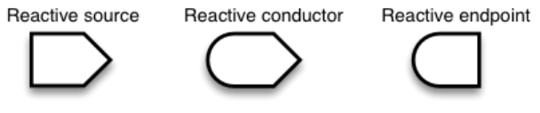
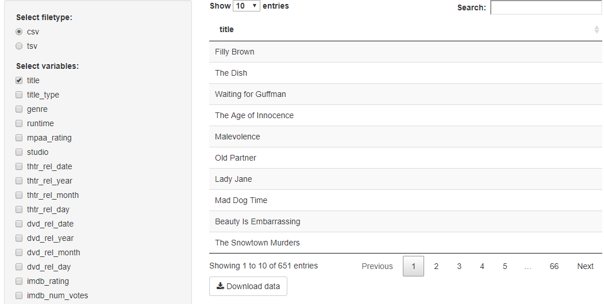
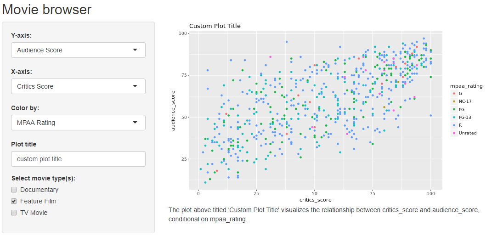
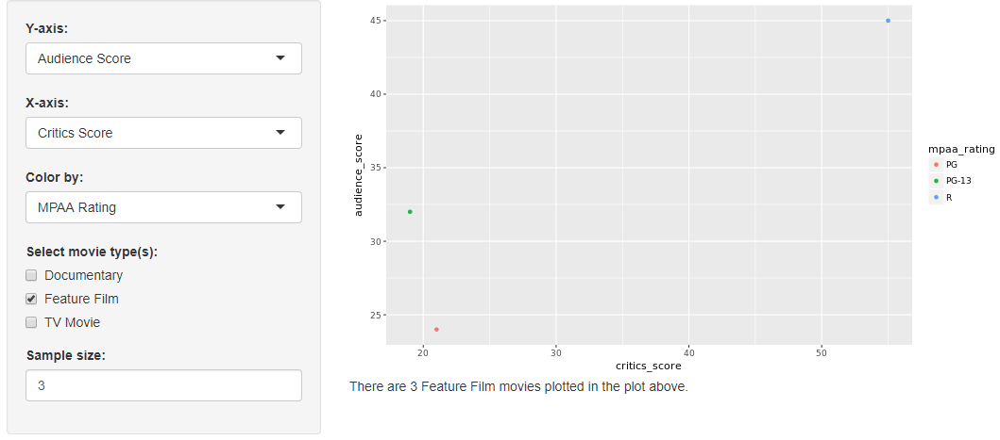
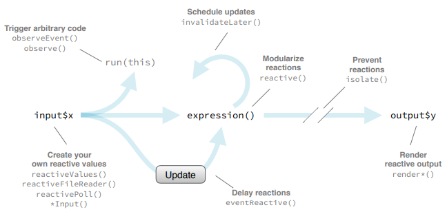
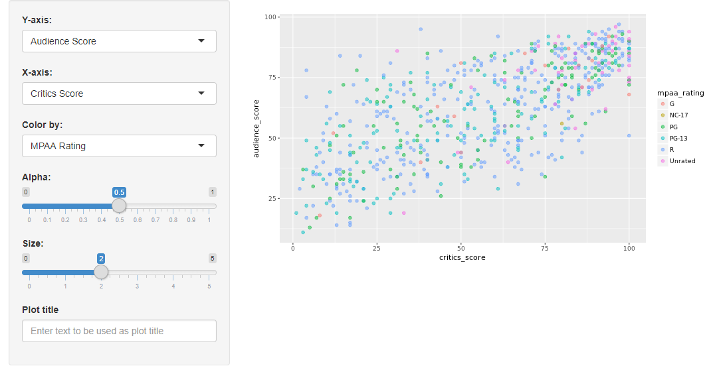

## Reactive Elements

There are three kinds of objects in reactive programming:

* **Reactive Sources**: user input that comes through a browser interface, typically.
* **Reactive Endpoints**: something that appears in the user's browser window, such as a plot or a table of values. A reactive source can be connected to multiple endpoints, and vice versa.
* **Reactive Conductors**: reactive component between a source and an endpoint. It can be a dependetn (child) and have dependents (parent) while **sources can only be parents** and **endpoints can only be children**



We can create a reactive data set using the **`reactive()`** function which creates a **cached expression** that knows it is out of date when input changes. Remember to check the availability of the predefined input with the **`req()`** function before doing any calculations that depends on it and surround the expression with curly braces. When you refer to a reactive data set you need to use parentheses after its name, that is, a cached expression, meaning that it only rerun when its inputs change.

```r
library(shiny)
library(dplyr)
library(readr)
load(url("http://s3.amazonaws.com/assets.datacamp.com/production/course_4850/datasets/movies.Rdata"))

# UI
ui <- fluidPage(
  sidebarLayout(
    
    # Input(s)
    sidebarPanel(
      
      # Select filetype
      radioButtons(inputId = "filetype",
                   label = "Select filetype:",
                   choices = c("csv", "tsv"),
                   selected = "csv"),
      
      # Select variables to download
      checkboxGroupInput(inputId = "selected_var",
                         label = "Select variables:",
                         choices = names(movies),
                         selected = c("title"))
      
    ),
    
    # Output(s)
    mainPanel(
      DT::dataTableOutput(outputId = "moviestable"),
      downloadButton("download_data", "Download data")
    )
  )
)

# Server
server <- function(input, output) {
  
  # Create reactive data frame
  movies_selected <- reactive({
    req(input$selected_var)
    movies %>% select(input$selected_var)
  })
  
  # Create data table
  output$moviestable <- DT::renderDataTable({
    req(input$selected_var)
    DT::datatable(data = movies_selected(), 
                  options = list(pageLength = 10), 
                  rownames = FALSE)
  })
  
  # Download file
  output$download_data <- downloadHandler(
    filename = function() {
      paste0("movies.", input$filetype)
    },
    content = function(file) { 
      if(input$filetype == "csv"){ 
        write_csv(movies_selected(), file) 
      }
      if(input$filetype == "tsv"){ 
        write_tsv(movies_selected(), file) 
      }
    }
  )
  
}

# Create a Shiny app object
shinyApp(ui = ui, server = server)
```

!!! tip
    The obvious choice for creating a text output would be `renderText` but if you want to get a little fancier including some HTML to use some text decoration, like bolding and line breaks in the text output, we need a rendering function that generates HTML, which is `renderUI`.
    


## Why Using Reactives?

By using a reactive expression for the subsetted data frame, we were able to get away with subsetting once and then using the result twice.

In general, reactive conductors let you not repeat yourself (i.e. avoid copy-and-paste code) and decompose large, complex calculations into smaller pieces to make them more understandable. This benefits are similar to decomposing a large complex R script into a series of small functions that build on each other.

### Functions vs Reactives

Each time you call a function, R will revaluate it. However, reactive expressions are lazy, they only get executed when their input changes. This means that even if you call a reactive expression multiple times, it only re-executes when its input(s) change(s).

Using many reactive expressions in your app can create a complicated dependency structure. The **`reactlog`** is a graphical representation of this dependency structure, and it also gives you very detailed information about what's happening under the hood as Shiny evaluates your application. To view the **`reactlog`**:

* In a fresh R session and run `options(shiny.reactlog = TRUE)` 
* Then, launch your app as you normally would
* In the app, pres **Ctrl+F3**

```r
library(shiny)
library(ggplot2)
library(dplyr)
library(tools)
load(url("http://s3.amazonaws.com/assets.datacamp.com/production/course_4850/datasets/movies.Rdata"))

# Define UI for application that plots features of movies
ui <- fluidPage(
  
  # Application title
  titlePanel("Movie browser"),
  
  # Sidebar layout with a input and output definitions
  sidebarLayout(
    
    # Inputs(s)
    sidebarPanel(
      
      # Select variable for y-axis
      selectInput(inputId = "y", 
                  label = "Y-axis:",
                  choices = c("IMDB rating" = "imdb_rating", 
                              "IMDB number of votes" = "imdb_num_votes", 
                              "Critics Score" = "critics_score", 
                              "Audience Score" = "audience_score", 
                              "Runtime" = "runtime"), 
                  selected = "audience_score"),
      
      # Select variable for x-axis
      selectInput(inputId = "x", 
                  label = "X-axis:",
                  choices = c("IMDB rating" = "imdb_rating", 
                              "IMDB number of votes" = "imdb_num_votes", 
                              "Critics Score" = "critics_score", 
                              "Audience Score" = "audience_score", 
                              "Runtime" = "runtime"), 
                  selected = "critics_score"),
      
      # Select variable for color
      selectInput(inputId = "z", 
                  label = "Color by:",
                  choices = c("Title Type" = "title_type", 
                              "Genre" = "genre", 
                              "MPAA Rating" = "mpaa_rating", 
                              "Critics Rating" = "critics_rating", 
                              "Audience Rating" = "audience_rating"),
                  selected = "mpaa_rating"),
      
      # Enter text for plot title
      textInput(inputId = "plot_title", 
                label = "Plot title", 
                placeholder = "Enter text for plot title"),
      
      # Select which types of movies to plot
      checkboxGroupInput(inputId = "selected_type",
                         label = "Select movie type(s):",
                         choices = c("Documentary", "Feature Film", "TV Movie"),
                         selected = "Feature Film")
      
    ),
    
    # Output(s)
    mainPanel(
      plotOutput(outputId = "scatterplot"),
      textOutput(outputId = "description")
    )
  )
)

# Server
server <- function(input, output) {
  
  # Create a subset of data filtering for selected title types
  movies_subset <- reactive({
    req(input$selected_type)
    filter(movies, title_type %in% input$selected_type)
  })
  
  # Convert plot_title toTitleCase
  pretty_plot_title <- reactive({
    toTitleCase(input$plot_title)
  })
  
  # Create scatterplot object the plotOutput function is expecting
  output$scatterplot <- renderPlot({
    ggplot(data = movies_subset(), 
           aes_string(x = input$x, y = input$y, color = input$z)) +
      geom_point() +
      labs(title = pretty_plot_title())
  })
  
  # Create descriptive text
  output$description <- renderText({
    paste0("The plot above titled '", pretty_plot_title(), "' visualizes the relationship between ", input$x, " and ", input$y, ", conditional on ", input$z, ".")
  })
  
}

# Create the Shiny app object
shinyApp(ui = ui, server = server)
```



```r
library(shiny)
library(ggplot2)
library(dplyr)
load(url("http://s3.amazonaws.com/assets.datacamp.com/production/course_4850/datasets/movies.Rdata"))

# UI
ui <- fluidPage(
  sidebarLayout(
    
    # Input(s)
    sidebarPanel(
      
      # Select variable for y-axis
      selectInput(inputId = "y", 
                  label = "Y-axis:",
                  choices = c("IMDB rating" = "imdb_rating", 
                              "IMDB number of votes" = "imdb_num_votes", 
                              "Critics Score" = "critics_score", 
                              "Audience Score" = "audience_score", 
                              "Runtime" = "runtime"), 
                  selected = "audience_score"),
      
      # Select variable for x-axis
      selectInput(inputId = "x", 
                  label = "X-axis:",
                  choices = c("IMDB rating" = "imdb_rating", 
                              "IMDB number of votes" = "imdb_num_votes", 
                              "Critics Score" = "critics_score", 
                              "Audience Score" = "audience_score", 
                              "Runtime" = "runtime"), 
                  selected = "critics_score"),
      
      # Select variable for color
      selectInput(inputId = "z", 
                  label = "Color by:",
                  choices = c("Title Type" = "title_type", 
                              "Genre" = "genre", 
                              "MPAA Rating" = "mpaa_rating", 
                              "Critics Rating" = "critics_rating", 
                              "Audience Rating" = "audience_rating"),
                  selected = "mpaa_rating"),
      
      # Select which types of movies to plot
      checkboxGroupInput(inputId = "selected_type",
                         label = "Select movie type(s):",
                         choices = c("Documentary", "Feature Film", "TV Movie"),
                         selected = "Feature Film"),
      
      # Select sample size
      numericInput(inputId = "n_samp", 
                   label = "Sample size:", 
                   min = 1, max = nrow(movies), 
                   value = 3)
    ),
    
    # Output(s)
    mainPanel(
      plotOutput(outputId = "scatterplot"),
      uiOutput(outputId = "n")
    )
  )
)

# Server
server <- function(input, output) {
  
  # Create a subset of data filtering for selected title types
  movies_subset <- reactive({
    req(input$selected_type)
    filter(movies, title_type %in% input$selected_type)
  })
  
  # Create new df that is n_samp obs from selected type movies
  movies_sample <- reactive({ 
    req(input$n_samp)
    sample_n(movies_subset(), input$n_samp)
  })
  
  # Create scatterplot object the plotOutput function is expecting
  output$scatterplot <- renderPlot({
    ggplot(data = movies_sample(), aes_string(x = input$x, y = input$y, color = input$z)) +
      geom_point()
  })
  
  # Print number of movies plotted
  output$n <- renderUI({
    types <- movies_sample()$title_type %>% 
      factor(levels = input$selected_type) 
    counts <- table(types)
    HTML(paste("There are", counts, input$selected_type, "movies plotted in the plot above. <br>"))
  })
  
}

# Create a Shiny app object
shinyApp(ui = ui, server = server)
```



## Reactives and observers

Here we discuss implementations of the three different types of reactive objects. As we go through the different implementations, it's recommended to think back to where they appear on the reactive flow chart.



* **Implementation of Reactive Sources**: An implementation of reactive sources is **`reactiveValues()`**. One example of this is user inputs. The input object is a reactive value that looks like a list and contains many individual reactive values that are set by input from the web browser.
* **Implementation of Reactive**: The implementation of reactive conductors is a **`reactive()`** expression that you can create with the reactive function. An example is the reactive data frame subsets created in the previous example. 
    * Reactive expressions can access reactive values or other reactive expressions and they return a value. 
    * They are useful for caching the results of any procedure that happens in response to user input.
* **Implementation of Reactive**: The implementation of reactive endpoints is **`observe()`**. For example, an output object is a reactive observer. Actually, under the hood, a render function returns a reactive expression, and when you assing this reactive expression to an output value, Shiny automatically creates an observer that uses the reactive expression. 
    * Observers can access reactive sources and reactive expressions, but they don't return a value.
    * Instead they are used for their side effects, which typically involves sending data to the web browser.

### Reactives vs Observers

* Similarities: they both store expressions that can be executed
* Differences:
    * Reactive expressions return values, but observers don't
    * Observers (and endpoints in general) eagerly respond to changes in their dependences, but reactive expressions (and conductors in general) do not
    * Reactive expressions must not have side effects, while observers are only useful for their side effects
* Most importantly:
    * The **`reactive()`** function is used when calculating values, without side effects
    * The **`observe()`** function is used to perform actions, with side effects
    * Do not use an **`observe()`** function when calculating a value, and especially don't use **`reactive()`** for performing actions with side effects
    
|                  | **`reactive()`** | **`observe()`** |
|------------------|------------------|-----------------|
| **Purpose**      | Calculations     | Actions         |
| **Side effects** | Forbidden        | Allowed         |

## Stop-Trigger-Delay 

### Isolating Reactions

Suppose your app has an input widget where users can enter text for the title of the plot. However, you only want the title to update if any ot the other inputs that go into the plot change. You can achieve this by isolating the plot title such that when `input$x` or `input$y` changes, the plot, along with the title, will update. But when only the title input changes, the plot will not update.

```r
output$scatterplot <- renderPlot({
  ggplot(data = movies_subset(), aes_string(x = input$x, y = input$y)) + 
  geom_point() +
  labs(title = isolate({ input$plot_title }) )
})
```

`isolate()` is then used to stop a reaction.

### Triggering Reactions

Why might one want to explicitly trigger a reaction? Somethimes you might want to wait for a specific action to be taken from the user, like clicking an `actionButton`, before calculating an expression or taking an action. A reactive value or expression that is used to trigger other calculations in this way is called an **event**. 

These events can be the **first argument** in the `observeEvent` function. This arguments can be a simple reactive value like an input, a call to a reactive expression, or a complex expresion provided wrapped in curly braces. The **second argument** is the expression to call whenever the first argument is invalidated. This is similar to saying if event expression happens, call handler expression.

```r
observeEvent(eventExpr, handlerExpr, ...)
```

Suppose your app allows for taking a random sample of the data based on a sample size numeric input. Suppose also that you want to add functionality for the userd to download the random sample they generated *if* they press an action button requesting to do so. In the UI we create an action button and in the server we condition the `observeEvent` on the `inputId` of that action button. This way R knows to call the expression given in the second argument of `observeEvent` when the user presses the action button. And finally we can delay reactions with `eventReactive`, which takes similar arguments as `observeEvent`.

```r
# UI
actionButton(inputId = "write_csv", label = "Write CSV")

# Server
observeEvent(input$write_csv, {
            filename <- paste0("movies_",
                               str_replace_all(Sys.time(), ":|\ ", "_"),
                               ".csv")
            write_csv(movies_sample(), path = filename)
            }
```

Suppose your goal is to change how users take random samples in your app (you only want them to get a new sample when an action button that says "get new sample" is pressed, not when other things like numeric input defining the size of the sample changes). In the event reactive function, the first argument is the input associated with the action button and the second argument is the sampling code. Then we add one more argument, `ignoreNull`, which tells R what to do (or what not to do) when the event expression evaluates to Null. For example, what should the app do when the app is first launched and the user has not even interacted with the app yet? If this is set to FALSE, the app will initially perform the action or calculation and then the user can re-initiate it.

```r
# UI
actionButton(inputId = "get_new_sample", label = "Get new sample")

# Server
movies_sample <- eventReactive(input$get_new_sample, {
            req(input$n_samp)
            sample_n(movies_subset(), input$n_samp)
            },
            ignoreNULL = FALSE
)
```

`observeEvent()` and `eventReactive()` look and feel very similar. They have the same syntax, same arguments, but they're actually not the same at all!

* `observeEvent()` is to perform an action in response to an event
* `eventReactive()` is used to create a calculated value that only updates in response to an event

This pair of functions also seem similar to the observe/reactive pair, however, the main differences between them is that `observe()` and `reactive()` functions automatically trigger on whatever they access while `observeEvent()` and `eventReactive()` functions need to be explicitly told what triggers them.

```r
library(shiny)
library(ggplot2)
library(tools)
load(url("http://s3.amazonaws.com/assets.datacamp.com/production/course_4850/datasets/movies.Rdata"))

# UI
ui <- fluidPage(
  sidebarLayout(
    
    # Input
    sidebarPanel(
      
      # Select variable for y-axis
      selectInput(inputId = "y", 
                  label = "Y-axis:",
                  choices = c("IMDB rating" = "imdb_rating", 
                              "IMDB number of votes" = "imdb_num_votes", 
                              "Critics Score" = "critics_score", 
                              "Audience Score" = "audience_score", 
                              "Runtime" = "runtime"), 
                  selected = "audience_score"),
      
      # Select variable for x-axis
      selectInput(inputId = "x", 
                  label = "X-axis:",
                  choices = c("IMDB rating" = "imdb_rating", 
                              "IMDB number of votes" = "imdb_num_votes", 
                              "Critics Score" = "critics_score", 
                              "Audience Score" = "audience_score", 
                              "Runtime" = "runtime"), 
                  selected = "critics_score"),
      
      # Select variable for color
      selectInput(inputId = "z", 
                  label = "Color by:",
                  choices = c("Title Type" = "title_type", 
                              "Genre" = "genre", 
                              "MPAA Rating" = "mpaa_rating", 
                              "Critics Rating" = "critics_rating", 
                              "Audience Rating" = "audience_rating"),
                  selected = "mpaa_rating"),
      
      # Set alpha level
      sliderInput(inputId = "alpha", 
                  label = "Alpha:", 
                  min = 0, max = 1, 
                  value = 0.5),
      
      # Set point size
      sliderInput(inputId = "size", 
                  label = "Size:", 
                  min = 0, max = 5, 
                  value = 2),
      
      # Enter text for plot title
      textInput(inputId = "plot_title", 
                label = "Plot title", 
                placeholder = "Enter text to be used as plot title")

    ),
    
    # Output:
    mainPanel(
      plotOutput(outputId = "scatterplot")
    )
  )
)

# Define server function required to create the scatterplot-
server <- function(input, output, session) {
  
  # Create scatterplot object the plotOutput function is expecting 
  output$scatterplot <- renderPlot({
    ggplot(data = movies, aes_string(x = input$x, y = input$y, color = input$z)) +
      geom_point(alpha = input$alpha, size = input$size) +
      labs(title = isolate({toTitleCase(input$plot_title)}) )
  })
  
}

# Create a Shiny app object
shinyApp(ui = ui, server = server)
```


