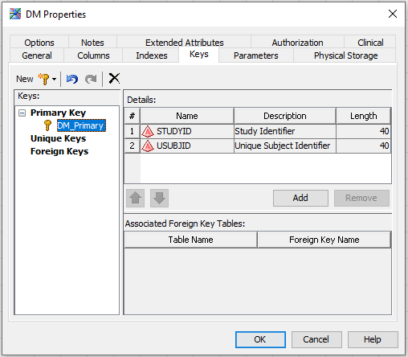

!!!Summary "Check these Websites"
    * [Using SAS CDI to Implement and Manage CDISC Standards](https://www.yumpu.com/en/document/view/32137420/using-sas-clinical-data-integration-to-implement-and-phuse-wiki)

!!! summary "Series of Short Videos on the SAS Clinical Data Integration Solution (CDI)"
    1. [Defining a Clinical Study](https://youtu.be/JftoqxZdd5I)
    2. [Registering Source or Raw Data](https://youtu.be/lRz5t5UIN_U)
    3. [Defining SDTM Domain Metadata](https://youtu.be/kockvXrONiE)
    4. [Mapping Source Data to SDTM Domains](https://youtu.be/h0Ds8zr5DHc)
    5. [Creating Job Templates](https://youtu.be/vEOy6EkTbIA)

## Implementing SDTM with SAS Clinical Data Integration

SAS Clinical Data Integration is an ETL tool built on top of SAS Data Management that includes specific functionality to support clinical trials.

## How to Create a Standard SDTM Domain

### Loading the Standard Structure

Please not before starting this process that each project is not allowed to have more than one active domain with the same name.

To create a standard SDTM Domain:
Folders > [Project name] > SDTM (right click)> New > Standard Domain(s)...

Then you need to follow these steps:

  * **Domain Location**: select the folder where the new Domain(s) will be placed
  * **Data Standard Selection**: select the applicable data standard (right now there is only one available, SDTMv3.2)
  * **Domain Template Selection**: select the *Domain Template* to apply
  * **Library Selection**: right now there are no default libraries so you would need to define it later 

After a *Creating the specified domains* message you will find the new Domain in your SDTM folder, it will be empty as you have only created the structure.

### Fill with Data

Once you have the structure of the dataset you want to create, you need to define a operation flow to achieve this structure thourgh the concatenation of the following **transformations**: 

  * **Access > Table Loader**: is needed as the previous step to a SDTM domain definition
  
  
  
  * **SQL > Create Table**: will allow any kind of operations in the input dataset
  
  
  
  * **Data > Sort**:
  
  * **Data > Append**:
  
  * **Data > User written Code**:
  
  * **SQL > Join**:
  
  * **SQL > Extract**:

## Warnings and Errors
  
### Integrity Constraint Compliance
The following warning message can appear for two main reasons:

  * The primary keys of the output dataset are not well defined: some are automatically defined but you may need to add some extra ones to avoid information overlapping
  
  
  
  * Some variables have missing values: this may come from an earlier flow step or mapping mistake, but some variables can't be null 
