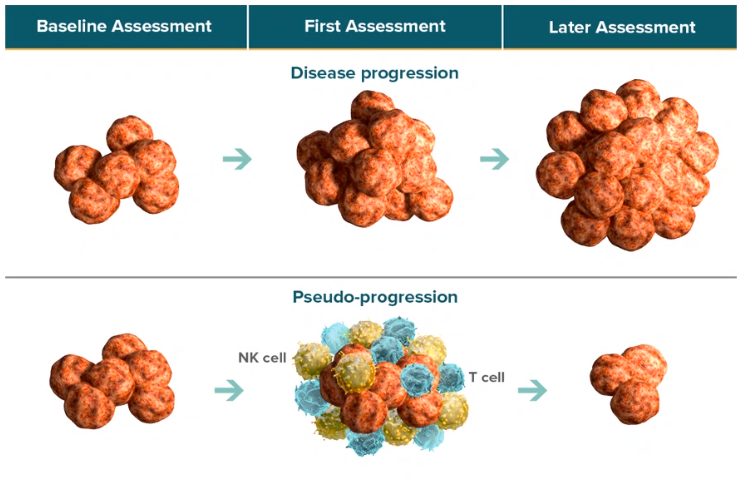

!!! summary "Check these websites"
    * [iRECIST at the RECIST Working Group Official Website](http://recist.eortc.org/irecist/)
    * [Merck Imaging Tip Sheet for RECIST 1.1 and iRECIST](http://nps-training.com/Courses/Other%20MyLearning%20Courses/RECIST1.1_Study%20Sites_SCORM_110917/story_content/external_files/iRECIST_Modified_RECIST_for_Immunotherapy_v8.pdf)

## iRECIST vs RECIST 1.1

### Unchanged

* Definitions of measurable, non-measurable disease 
* Definitions of target (T) and non target (NT) lesions 
* Measurement and management of nodal disease 
* Calculation of the sum of measurement (SOM) 
* Definitions of complete (CR) and partial response (PR), stable disease (SD) and their duration 
* Confirmation of CR and PR and when applicable 
* Definition of progression in T and NT (iRECIST terms i-unconfirmed progression (iUPD))

### Changed

* Management of new lesions 
* Time point response after RECIST 1.1 progression 
* Confirmation of progression required 
* Collection of reason why progression cannot be confirmed 
* Inclusion and recording of clinical status

### New Lesions

New lesions (NL) are assessed using RECIST 1.1 principles:

* Classified as measurable or non-measurable 
* Up to 5 (2 per site) measured (but not included in the sum of measurements of target lesions identified at baseline) and recorded as new lesions target (NL-T) with an i-sum of measurements (iSOM) 
* Other new lesions (measurable/non-measurable) are recorded as new lesions non-target (NL-NT) 
* New lesions do not have to resolve for subsequent iSD or iPR providing that the next assessment did not confirm progression

### Time Point Response

In iRECIST there can be **iSD**, **iPR** or **iCR** after RECIST 1.1 PD.

* *Once a PD always a PD* is no longer the case 
* First RECIST 1.1 PD is "unconfirmed" for iRECIST – termed **iUPD** 
* iUPD must be confirmed at the next assessment (4-8 weeks) 
* If confirmed, termed **iCPD**

Time point response is dynamic and based on:
* Change from baseline (for iCR, iPR, iSD) or change from nadir (for PD) 
* The last i-response

### Progression

Treatment past RECIST 1.1 PD should only be considered if patient clinically stable (recommendation, may be protocol specific): 

* No worsening of performance status
* No clinically relevant worsening in disease related symptoms 
* No requirement for intensified management of disease related symptoms (analgesics, radiation, palliative care) 

Record the reason iUPD not confirmed: 

* Not stable 
* Treatment stopped but patient not reassessed/imaging not performed 
* iCPD never occurs 
* Patient has died

## iRECIST: Confirming Progression (iCPD)

* Must be the NEXT assessment – if iSD, iPR or iCR intervenes then bar is reset and iUPD must occur again and be confirmed
* Two ways to confirm 
    * Existing iUPD gets worse – "low bar"
    * Lesion category without prior iUPD now meet RECIST 1.1 criteria for PD – "RECIST PD" 
* If confirmatory scans not done must document reason why

## Statistical and Data Considerations

### Primary and Exploratory Response Criteria

* RECIST 1.1 should remain primary criteria 
* iRECIST exploratory
  
### Date of i-Progression

* Will be the same as RECIST 1.1 date (i.e. first iUPD date) UNLESS iSD, iPR or iCR intervenes 
* Will be the UPD date which has been subsequently confirmed 
    * The date used is the first UPD date 
* If iUPD never confirmed 
    * If a subsequent iSD, iPR or iCR is seen with no later iUPD or iCPD then the initial iUPD is ignored 
		* Otherwise the iUPD date is used
			  * Patient not considered to be clinically stable, stops protocol treatment and no further response assessments are done 
			  * The next TPRs are all iUPD, and iCPD never occurs. 
			  * The patient dies of cancer

### Data Collection

Investigator/site assessment is the primary method of evaluation for RECIST and iRECIST in keeping with RWG principles.
Record time-point and best overall response for both.

* RECIST 1.1 
* iRECIST 

Record reasons

* Treatment discontinued when iUPD 
* iCPD not confirmed 

Independent imaging review can occur in parallel if indicated. 
We recommend CT images be collected if feasible.

## Summary: RECIST 1.1 vs. iRECIST 

|     | **RECIST 1.1** | **iRECIST**  |
|-------|------------------|----------------|
|**Definitions of measurable and non-measurable disease; numbers and site of target disease**| Measurable lesions are >=10mm in long diameter (15mm for nodal lesions); maximum of 5 lesions (2 per organ); all other disease considered not-target (must be 10mm of longer in short axis for nodal disease) | No change; however, <ul><li>NEW lesions assessed per RECIST 1.1 </li><li>Recorded separately on the CRF </li><li>NOT included in the SOM for target lesions identified at baseline</li></ul>|
|**CR, PR or SD**|Cannot have met criteria for PD prior to CR, PR or SD|May have had iUPD (1 or more instances), but not iCPD, prior to iCR, iPR or iSD|
|**Confirmation of CR, PR**|Only required for non-randomized trials|As per RECIST 1.1 |
|**Confirmation of SD**|Not required|As per RECIST 1.1 |
|**New lesions**|Results in PD. Recorded but not measured|Results in iUPD but iCPD is only assigned based on this category if at next assessment <ul><li>Additional NL appear or </li><li>Increase in size of NLs (≥5mm for SOM of NLT or any increase in NLNT) </li></ul> Remember NLs can also confirm iCPD if iUPD was only in T or NT disease|
|**Independent blinded review and central collection of scans**|Recommended in some circumstances|Collection of scans (but not independent review) recommended for all trials |
|**Confirmation of PD**|Not required (unless equivocal)|Always required|
|**Consideration of clinical status**|Not included in assessment|Clinical stability is always considered and collected on case record form|

## iRECIST in a Nutshell

* RECIST 1.1 – primary criteria 
* iRECIST exploratory and applicable only after RECIST1.1 progression occurs 
    * Most patients will not have ‘pseudoprogression’ 
* Principles of iRECIST follow RECIST 1.1 very closely 
    * RECIST 1.1 principles are generally the default except: 
        * Management of new lesions 
	* What constitutes confirmation of progression 
    * Assess RECIST 1.1 and iRECIST separately but in parallel at each time point 
* Progression must be confirmed 
    * Consider treatment past progression only in carefully defined scenarios 
    * Confirmation requires some worsening of disease bulk 
        * Must be next evaluable assessment after iUPD 
	* Lesion category with existing iUPD just needs to get a little bit worse OR 
	* Lesion category without prior iUPD has to meet RECIST 1.1 criteria for progression 
* New lesions 
    * Managed using RECIST 1.1 principles 
    * NOT added to SOM (but included in separate iSOM) 
* Unconfirmed progression does not preclude a later i-response
* Response after iUPD is driven by TARGET disease (as long as iCPD not confirmed) 
* This means that can have subsequent iSD or iPR in target lesions (compared to baseline) EVEN IF 
    * The new lesion seen at the time of iUPD is still there
    * The unequivocal increase in non-target lesions at the time of iUPD hasn’t improved
* "Bar reset" does mean that: a previously observed iUPD can be ignored if there is an intervening response (i.e. if criteria for iPR, iCR, or iSD are met ) 
* "Bar reset" does not mean that: the baseline or the nadir are re-set 
    * iCR/iPR/iSD still calculated from BASELINE 
    * i progression date still calculated from NADIR (which may or may not be the same as baseline – and could be before or after any iUPD)
