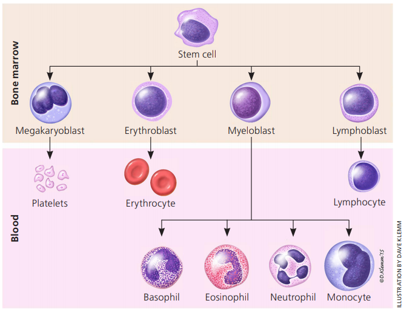

## Hematology

**Hematology** is the study of blood and blood disorders to help in the diagnosis, treatment, and prevention of diseases of the blood and bone marrow as well as of the immunologic, hemostatic (blood clotting) and vascular systems. Because of the nature of blood, the science of hematology profoundly affects the understanding of many diseases.

All our **blood cells develop from stem cells in the bone marrow**. Stem cells are blood cells at the earliest stage of development and they stay inside the bone marrow until they are fully developed which is when they go into the bloodstream. Blood cells do not live long. The bone marrow normally makes millions of new blood cells every day to replace blood cells as they are needed.

The three main types of blood cells are:

* **Red blood cells (RBC) or erythrocytes** are the most common type of blood cells. They lack a cell nucleus and most organelles, in order to accommodate maximum space for hemoglobin; they can be viewed as sacks of hemoglobin, with a plasma membrane as the sack.  
    * **Hemoglobin (HGB)** is an iron-containing biomolecule that can bind oxygen and is responsible for the red color of the cells and the blood.
    * The **hematocrit (HCT)**, is the volume percentage of red blood cells in blood.

* **Platelets (PLAT) or thrombocytes** help the blood to clot and prevent bleeding and bruising.
* **White blood cells (WBC) or leucocytes** fight and prevent infection.
    * **Basophils (BASO)**
    * **Eosinophils (EOS)**
    * **Neutrophils (NEUT)**
    * **Monocytes (MONO)**
    * **Lymphocytes (LYM)**

### Normal Ranges' Rule of Thumb 

| **Type of blood cell** | **Unit**   | **Levels**                       |
|------------------------|------------|----------------------------------|
| Red blood cells (RBC)  | g/l        | Men: 130-180, Women: 115-165     |
| Hematocrit (HCT)       | %          | Men: 41-50, Women: 36-44         |
| Hemoglobin (HGB)       | g/l        | Men: 13.5-16.5, Women: 12.0-15.0 |
| Platelets              | 10^9/L     | 150-400                          |
| White blood cells      | 10^9/L     | 4.0-11.0                         |
| Neutrophils            | 10^9/L     | 2.0-7.5                          |
| Lymphocytes            | 10^9/L     | 1.5-4.5                          |

!!! summary "Check these websites"
    * [Laboratory values](http://globalrph.com/laboratory-values/)

### Blood-Related Anomalies

* **Neutrophil-to-Lymphocyte Ratio (NLR)**, defined as absolute neutrophils count divided by absolute lymphocytes count, has been reported as poor prognostic factor in several neoplastic diseases. In the case of colorectal cancer, elevated pre-operative ($NLR>5$) is associated with poorer long-term survival. NLR is a useful biomarker in delineating those patients with poorer prognosis and whom may benefit from adjuvant therapies.
* **Leucocytosis**, often defined as an elevated white blood cell (WBC) count greater than $11000/mm^3$ ($11.0 \cdot 10^9/L$) in nonpregnant adults, is a relatively common finding with a wide differential. It is important for clinicians to be able to distinguish malignant from nonmalignant etiologies, and to differentiate between the most common nonmalignant causes of leukocytosis. Leukocytosis in the range of approximately $50-100 \cdot 10^9/L$ is sometimes referred to as a **leukemoid reaction**. This level of elevation can occur in some severe infections, such as Clostridium difficile infection, sepsis, organ rejection, or in patients with solid tumors. Leukocytosis greater than $100 \cdot 10^9/L$ is almost always caused by leukemias or myeloproliferative disorders.
* An abnormally low hematocrit (as well as a decrease in the total amount of red blood cells or hemoglobin in the blood) may suggest **anemia**, a decrease in the total amount of red blood cells, while an abnormally high hematocrit is called **polycythemia**. Both are potentially life-threatening disorders.
* **Thrombocythemia or thrombocytosis** is the presence of high platelet counts in the blood. Although often symptomless, it can predispose to thrombosis in some patients. Thrombocytosis can be contrasted with **thrombocytopenia**, a loss of platelets in the blood.

## Chemistry

* **Total protein**: the concentration of all fractions of plasma proteins
   * **Hypoproteinaemia**: total blood protein decrease below 65 g/l (life threatening when total protein concentration $< 40 g/l$ and albumin $< 20 g/l$
   * **Hyperproteinaemia**: 
* **Potassium concentration in blood serum**:
    * **Hypokalaemia**: $K_{serum} < 3.5 \: mmol/l$
    * **Hyperkalaemia**: $K_{serum} < 5.2 \: mmol/l$
* **Sodium concentration in blood serum**:
    * **Hyponatraemia**: $Na_{serum}< 135 \: mmol/l$
    * **Hypernatraemia**: $Na_{serum}> 150 \: mmol/l$
    * **Causes of sodium deficiency**: renal/skin/intestinal losses
    * **Causes of sodium excess**: decreased sodium excretion or excessive intake

### Enzyme Diagnostics

Enzymes synthesis, functioning and breakdown take place continuously and simultaneously. They are localized in different cellular compartments (cytoplasm, lysosomes, cellular membrane, mitochondrions) and therefore, that is why increased activity of certain enzymes can indicate cellular damage. 

Serum enzymes are divided into 3 groups:

1. **Cellular enzymes** enter the blood from different organs (divided into non-specific and organ specific).
2. **Secretory enzymes** are synthesized by cells, enter the bloodstream and fulfill their specific functions in the circulatory system. These are enzymes of coagulation system and fibrinolysis, choline esterase, etc.
3. **Excretory enzymes** are synthesized by glands of the gastrointestinal tract and enter the blood (amylase, lipase).

Here, we have provided information about enzymes which are most frequently used in clinical practice for diagnosis, prognosis and therapy monitoring of different pathologies. Their determination in blood serum has high clinical significance.

* **Aminotransferases**: they catalyze the process of transamination and are present in every organ and tissue. 
   * **АLТ**: Highest concentration of ALT is noted in the liver cells. **Increased** ALT activity is most frequently revealed in acute liver and biliary ducts diseases.
   * **АSТ**: High concentration of AST is noted in heart and skeletal muscles, liver, kidneys, pancreas and erythrocytes. Damage of any
of them leads to significant increase of AST in the blood serum. **Increase** in AST activity reveals hepatic pathology. **Low** AST activity usually reveals vitamin В6 deficiency, renal failure, pregnancy. 
   * **Ritis ratio**: AST/ALT ratio. Its normal value is around 1–1.3. It decreases in liver diseases and increases in heart diseases. 
* **Alkaline phosphatase (ALP)**:  is produced by various tissues: intestinal mucous membrane, osteoblasts, biliary ducts, placenta, mammary gland during lactation. Several isoenzymes of ALP are present in blood serum. Bone (ALP increases with
bone formation), liver (main indicator of biliary tract pathology), intestinal (small part of total ALP activity, may be increased by intestinal diseases accompanied by diarrhoea) and placental (appears in pregnancy during the 3rd trimester, increase in women with placenta damage) ones are the most significant for clinical and diagnostic purposes.
* **Gamma-Glutamyl Transpeptidase (GGT)**: it has a great significance in diagnosis of any pathology of liver and bile ducts (increased activity). The liver is considered as the main source of normal serum activity, despite the fact that the kidney has the highest level of the enzyme. Pancreas also contains GGT (100% of patients with acute pancreatitis show GGT activity 10-20 times higher than normal). If GGT activity is normal, liver disease probability is very low. Thus, GGT is a good marker for differential diagnosis of liver pathology. The most significant increase is observed in **cholestasis**. Determination of **GGT in urine** allows to diagnose the early stages of kidney disease, which is accompanied by proximal renal tubular damage.
* **Creatine Кinase (CК)**:
* **Lactate Dehydrogenase (LDH)**:
* ****:

## Urinalysis

## Coagulation

## Biomarkers

* **CEA (carcinoembryonic antigen)** is a protein found in many types of cells but associated with tumors and the developing fetus. A common cutoff is $5 \mu g/L$ (values bigger than this could be a sign of disease).
* Mutations in **KRAS exon 2**, **BRAF** and **PIK3CA** are commonly present in colorectal cancer (CRC).
