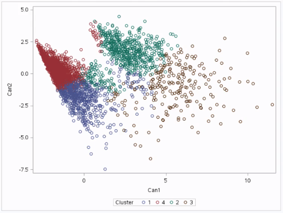

## Introduction to Cluster Analysis

When subjects are sampled, randomized or allocated by clusters, several statistical problems arise. If observations within a cluster are correlated, one of the assumptions of estimation and hypothesis testing is violated. Because of this correlation, the analyses must be modified to take into account the cluster design effect. When cluster designs are used, there are two sources of variations in the observations. The first is the **one between subjects within a cluster**, and the second is the **variability among clusters**. These two sources of variation cause the variance to inflate and must be taken into account in the analysis.

## Gettin' Ready for a Cluster Analysis

### Check for Missing Data

Variables with missing data should be excluded from the calculation unless they can be imputed.

### Dealing with Categorical Variables

#### Composite variables
Other questionnaire data like binary (yes/no questions) or a spectrum of responses can be transformed into **composite variables** to capture multiple questions into a **ranked ordinal scale**. A **composite variable** is a variable created by combining two or more individual variables, called indicators, into a single variable. Each indicator alone doesn't provide sufficient information, but altogether they can represent the more complex concept.

A lot of work goes into creating composite variables. The indicators of the multidimensional concept must be specified. It's important that each indicator contribute unique information to the final score. The formula for combining the indicators into a single score, called aggregating data, must be established. The computation involved will depend on the type of data that is being aggregated. To aggregate the data, raw scores might be summed, averaged, transformed, and/or weighted.

#### Hot encoding
Check [this website](https://heuristically.wordpress.com/2013/02/11/dummy-coding-sas/) for a macro to generate dummy variables.

#### Ordinal Categorical Variables

If your categorical variables have an ordinal meaning you can create an auxiliary numeric variable with indexes representing the ordinal scale and use this new variable, which can be standardized, for the analysis.

### Methods for data reduction
You may need to reduce the number of variables to include in the analysis. There are several methods for this:

* [Principal Component Analysis with `PROC FACTOR`](https://stats.idre.ucla.edu/sas/output/principal-components-analysis/)
* [Variable Reduction for Modeling using `PROC VARCLUS`](http://www2.sas.com/proceedings/sugi26/p261-26.pdf)

### Standardize your Data
When performing multivariate analysis, having variables that are measured at different scales can influence the numerical stability and precision of the estimators. Standardizing the data prior to performing statistical analysis can often prevent this problem.

!!! Warning
    Do not forget to change the format of your numerical data and increase the number of decimal places before performing the standardization. Otherwise you may lose a lot of details on this process that can be crucial for the data analysis.

!!! summary "Check these websites"
    * [Standardization Procedures](https://support.sas.com/rnd/app/stat/procedures/Standardization.html)
    * [Standardization of Variables in Cluster Analysis](https://support.sas.com/documentation/cdl/en/statug/63033/HTML/default/viewer.htm#statug_stdize_sect020.htm)

## SAS Procedures to Perform Cluster Analysis 

Ward's minimum-variance hierarchical clustering method using agglomerative (bottom-up) approach and Ward's linkage.

!!! summary "Check these websites"
    * [Introduction to Clustering Procedures](http://documentation.sas.com/?docsetId=statug&docsetTarget=statug_introclus_toc.htm&docsetVersion=14.2)

### `PROC CLUSTER`: Hierarchical Cluster Analysis

The `CLUSTER` procedure **hierarchically clusters the observations** in a SAS data set by using one of 11 methods. The data can be coordinates or distances. 

All methods are based on the usual agglomerative hierarchical clustering procedure. Each observation begins in a cluster by itself. The two closest clusters are merged to form a new cluster that replaces the two old clusters. Merging of the two closest clusters is repeated until only one cluster is left. The various clustering methods differ in how the distance between two clusters is computed.

```
data t;
	input cid $ 1-2 income educ;
cards;
c1 5 5
c2 6 6
c3 15 14
c4 16 15
c5 25 20
c6 30 19
run;

proc cluster simple noeigen method=centroid rmsstd rsquare nonorm out=tree;
id cid;
var income educ;
run;
```

* The `SIMPLE` option displays simple, descriptive statistics. 
* The `NOEIGEN` option suppresses computation of eigenvalues. Specifying the `NOEIGEN` option saves time if the number of variables is large, but it should be used only if the variables are nearly uncorrelated or if you are not interested in the cubic clustering criterion. 
* The `METHOD=` specification determines the clustering method used by the procedure. Here, we are using `CENTROID` method. The `Centroid Distance` that appears in the output is simply the Euclidian distance between the centroid of the two clusters that are to be joined or merged. It is a measure of the homogeneity of merged clusters and the value should be small.
* The `RMSSTD` option displays the root-mean-square standard deviation of each cluster. `RMSSTD` is the pooled standard deviation of all the variables forming the cluster. Since the objective of cluster analysis is to form homogeneous groups, the `RMSSTD` of a cluster should be as small as possible.
* The `RSQUARE` option displays the $R^2$ (`RSQ`) and semipartial $R^2$ (`SPRSQ`) to evaluate cluster solution. `RSQ` measures the extent to which groups or clusters are different from each other (so, when you have just one cluster `RSQ` value is, intuitively, zero). Thus, the `RSQ` value should be high.`SPRSQ` is a measure of the homogeneity of merged clusters, i.e. the loss of homogeneity due to combining two groups or clusters to form a new group or cluster.  Thus, its value should be small to imply that we are merging two homogeneous groups. 
* The `NONORM` option prevents the distances from being normalized to unit mean or unit root mean square with most methods. 
* The values of the `ID` variable identify observations in the displayed cluster history and in the `OUTTREE=` data set. If the `ID` statement is omitted, each observation is denoted by `OBn`, where n is the observation number.
* The `VAR` statement lists numeric variables to be used in the cluster analysis. If you omit the `VAR` statement, all numeric variables not listed in other statements are used.


### `PROC FASTCLUS`: Disjoint Cluster Analysis

The `FASTCLUS` procedure performs a **disjoint cluster analysis** on the basis of distances computed from one or more quantitative variables. The observations are **divided into clusters such that every observation belongs to one and only one cluster**; the clusters **do not form a tree structure** as they do in the `CLUSTER` procedure. If you want separate analyses for different numbers of clusters, you can run `PROC FASTCLUS` once for each analysis. The `FASTCLUS` procedure requires time proportional to the number of observations and thus can be used with much larger data sets than `PROC CLUSTER`.

```
data t2;
	input cid $ 1-2 income educ;
cards;
c1 5 5
c2 6 6
c3 15 14
c4 16 15
c5 25 20
c6 30 19
run;

proc fastclus radius=0 replace=full maxclusters=3 maxiter=20 list distance;
id cid;
var income educ;
run;
```

You must specify either the `MAXCLUSTERS=` or the `RADIUS=` argument in the `PROC FASTCLUS` statement.

* The `RADIUS=` option establishes the minimum distance criterion for selecting new seeds. No observation is considered as a new seed unless its minimum distance to previous seeds exceeds the value given by the `RADIUS=` option. The default value is 0. 
* The `MAXCLUSTERS=` option specifies the maximum number of clusters allowed. If you omit the `MAXCLUSTERS=` option, a value of 100 is assumed. 
* The `REPLACE=` option specifies how seed replacement is performed. 
    * `FULL` requests default seed replacement. 
    * `PART` requests seed replacement only when the distance between the observation and the closest seed is greater than the minimum distance between seeds. 
    * `NONE` suppresses seed replacement. 
    * `RANDOM` selects a simple pseudo-random sample of complete observations as initial cluster seeds. 
    
* The `MAXITER=` option specifies the maximum number of iterations for recomputing cluster seeds. When the value of the `MAXITER=` option is greater than 0, each observation is assigned to the nearest seed, and the seeds are recomputed as the means of the clusters. 
* The `LIST` option lists all observations, giving the value of the `ID` variable (if any), the number of the cluster to which the observation is assigned, and the distance between the observation and the final cluster seed. 
* The `DISTANCE` option computes distances between the cluster means. 
* The `ID` variable, which can be character or numeric, identifies observations on the output when you specify the `LIST` option.
* The `VAR` statement lists the numeric variables to be used in the cluster analysis. If you omit the `VAR` statement, all numeric variables not listed in other statements are used.

The cluster analysis may converge to a solution at the $n^{th}$ iteration because the change in cluster seeds at this iteration is less than the convergence criterion.  Note that a zero change in the centroid of the cluster seeds for the $n^{th}$ iteration implies that the reallocation did not result in any reassignment of observations.

The statistics used for the evaluation of the cluster solution are the same as in the hierarchical cluster analysis.

The cluster solution can also be **evaluated with respect to each clustering variable**. If the measurement scales are not the same, then for each variable one should obtain the **ratio** of the respective **Within STD** to the **Total STD**, and compare this ratio across the variables.

!!! tip "Interesting Examples"
    * [Multivariate Statistical Analysis in SAS: Segmentation and Classification of Behavioral Data](http://support.sas.com/resources/papers/proceedings13/447-2013.pdf)
    
### Mixed Clustering

On large data sets a useful methodology consists first in summarizing the observations in a large enough number of clusters (100 may be a standard value) and then applying a hierarchical clustering technique for aggregating these groups (Example [here](https://support.sas.com/documentation/cdl/en/statug/63033/HTML/default/viewer.htm#statug_cluster_sect027.htm)).

This procedure has the advantages of the hierarchical method for showing an optimal number of clusters and solves the difficulty of the too high initial number of observations by first clustering them, using a non hierarchical method, in a smaller number of clusters. This number is a parameter of the procedure; it must be high enough in order not to impose a prior partitionning of the data.

### `PROC VARCLUS`: Variable Clustering

The `VARCLUS` procedure divides a set of numeric variables into disjoint or hierarchical clusters. `PROC VARCLUS` tries to maximize the variance that is explained by the cluster components, summed over all the clusters.

In an ordinary principal component analysis, all components are computed from the same variables, and the first principal component is orthogonal to the second principal component and to every other principal component. In `PROC VARCLUS`, each cluster component is computed from a set of variables that is different from all the other cluster components. The first principal component of one cluster might be correlated with the first principal component of another cluster. Hence, the `PROC VARCLUS` algorithm is a type of oblique component analysis.

`PROC VARCLUS` can be used as a **variable-reduction method**. A large set of variables can often be replaced by the set of cluster components with little loss of information. A given number of cluster components does not generally explain as much variance as the same number of principal components on the full set of variables, but the cluster components are usually easier to interpret than the principal components, even if the latter are rotated.

```
PROC VARCLUS DATA=SAS-data-set MAXEIGEN=0.7 OUTTREE=fortree short noprint;	
	VAR variable1 variable2 variable3;
RUN;
```

### `PROC TREE`

The `TREE` procedure produces a tree diagram from a **data set created by the `CLUSTER` or `VARCLUS` procedure** that contains the results of **hierarchical clustering** as a tree structure.

```
proc tree data=tree out=clus3 nclusters=3;
id cid;
copy income educ;
```

The `TREE` procedure produces a tree diagram, also known as a dendrogram or phenogram, using a data set created by the `CLUSTER` procedure. The `CLUSTER` procedure creates output data sets that contain the results of **hierarchical clustering as a tree structure**. The `TREE` procedure uses the output data set to produce a diagram of the tree structure.

* The `NCLUSTERS=` option specifies the number of clusters desired in the `OUT=` data set.
* The `ID` variable is used to identify the objects (leaves) in the tree on the output. The `ID` variable can be a character or numeric variable of any length. 
* The `COPY` statement specifies one or more character or numeric variables to be copied to the `OUT=` data set.

## Choosing the Optimal Number of Clusters for the Analysis 

In most cases, before using a clustering technique you have no prior idea of the number of clusters which will give the better differenciation of the data. The main objective is to summarize the data in the best way possible, i.e. getting a compromise between a good degree of differentiation and a not too high number of clusters.

For hierarchical clustering try the Sarle's Cubic Clustering Criterion in PROC CLUSTER:
plot _CCC_ versus the number of clusters and look for peaks where _ccc_ > 3 or look for local peaks of pseudo-F statistic (_PSF_) combined with a small value of the pseudo-t^2 statistic (_PST2_) and a larger pseudo t^2 for the next cluster fusion.
For K-Means clustering use this approach on a sample of your data to determine the max limit for k and assign it to the maxc= option in PROC FASTCLUS on the complete data. 

For K-means cluster analysis, one can use `PROC FASTCLUS` like
```PROC FASTCLUS DATA=SAS-data-set OUT=out MAXC=4 MAXITER=20;```
and change the number defined by `MAXC=`, and run a number of times, then compare the **Pseduo F** and **CCC** values, to see which number of clusters gives peaks.
 
You can also use `PROC CLUSTER`
```PROC CLUSTER data=mydata METHOD=WARD out=out ccc pseudo print=15;```
to find the number of clusters with **pseudo F**, **pseudo-$t^2$** and **CCC**, and also look at junp in **Semipartial R-Square**.
 
Sometimes these indications do not agree to each other. which indicator is more reliable?
If you are doubting between 2 k-values, you can use Beale's F-type statistic to determine the final number of clusters. It will tell you whether the larger solution is significantly better or not (in the latter case the solution with fewer clusters is preferable).
This technique is discussed in the "Applied Clustering Techniques" course notes.

!!! summary "Check these websites"
    * [The Number of Clusters](http://support.sas.com/documentation/cdl/en/statug/63033/HTML/default/viewer.htm#statug_introclus_sect010.htm)
    
## Further Examination of the Cluster Analysis Solution

### Visualizing the Results

To interpret a cluster analysis solution, the first thing you want to try is to graph the cluster in a scatter plot to see whether or not they overlap with each other in terms of their location in the $p-$dimensional space. If the vectors have a high dimensionality,  we use **Canonical Discriminant Analysis (CDA)**. It is a **dimension-reduction technique related to principal component analysis and canonical correlation**. It creates a smaller number of variables that are linear combinations of the original $p$ clustering variables. The new variables, called canonical variables, are ordered in terms of the proportion of variance in the clustering variables that is accounted for by each of the canonical variables. Usually, the majority of the variants in the clustering variable will be accounted for by the first couple of canonical varaibles and those are the variables we can plot.

In SAS we can use the `CANDISC`procedure to create the canonical variables for our cluster analysis output data set that has the cluster assignment variable that we created when we ran the cluster analysis. 

```
PROC CANDISC DATA=clusterdata OUT=candata;
	CLASS cluster-assignment-variable;
	VAR clustering1 clustering2;
RUN;
```

* The `OUT=` is the output data set that includes the canonical variables that are estimated by the canonical discriminate analysis.
* The `CLASS` variable (mandatory) is the cluster assignment variable which is a categorical variable.
* In the `VAR` statement we list the clustering variables

You can then plot the first two canonical variables using the `SGPLOT` procedure:

```
PROC SGPLOT DATA=candata;
	SCATTER Y=can2 X=can1 / GROUP=cluster-assignment-variable;
RUN;
```

Let's analyze the following example result for a 4-cluster analysis.



What this shows is that the observations in **clusters 1 and 4** are densely packed, meaning they are pretty highly correlated with each other, and **within cluster variance is relatively low**. In addition, they **do not overlap** very much with the other clusters. The observations from **cluster 2** are a little more spread out, indicating less correlation among the observations and higher within cluster variance. But generally, the cluster is relatively distinct with the exception of some observations which are closer to clusters 1 and 4 indicating **some overlap** with these clusters. However, **cluster 3** is all over the place. There is come indication of a cluster but the observations are spread out more than the other clusters. This means that the **within cluster variance is high** as there is less correlation between the observations in this cluster, so we do not really know what is going to happen with that cluster. What this suggests is that the **best cluster solution may have fewer than 4 clusters**, meaning that it would be especially important to further evaluate the cluster solutions with fewer than four clusters.

!!! summary "Check these websites"
    * [Discriminant Function Analysis in SAS (UCLA)](https://stats.idre.ucla.edu/sas/dae/discriminant-function-analysis/)
    * [Introduction to Discriminant Procedures](http://documentation.sas.com/?docsetId=statug&docsetTarget=statug_introdisc_toc.htm&docsetVersion=14.2)
    
### Cluster Means and Standard Deviations

You can also check these values per cluster to detect possible similarities between groups and detect the most different ones.
