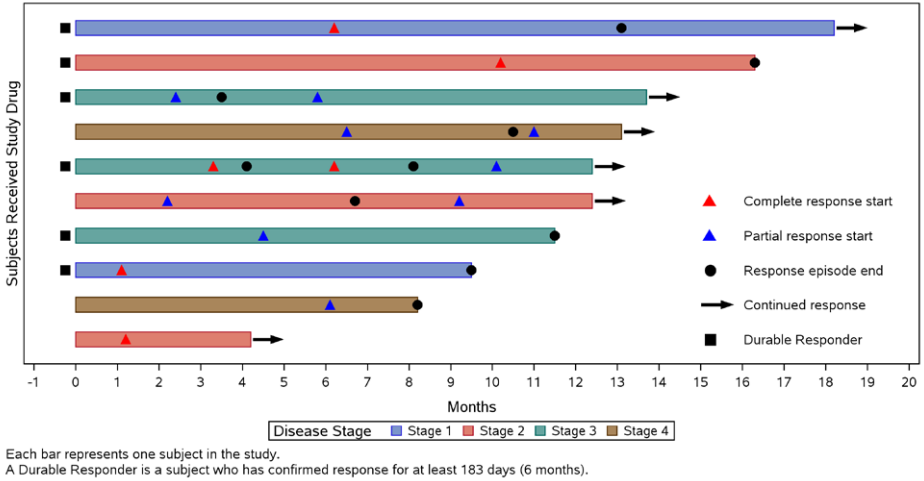
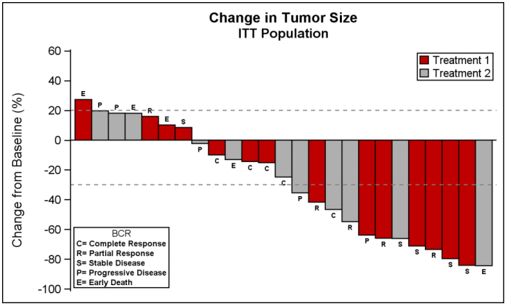
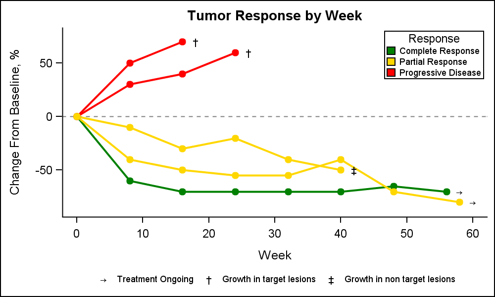
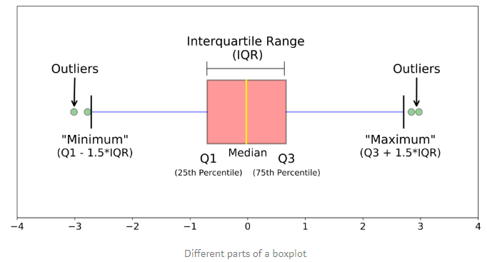

!!! summary "Check these websites"
    * [Here](https://support.sas.com/resources/papers/proceedings11/281-2011.pdf) are some examples of complex graphs.
    * [Here](http://support.sas.com/documentation/cdl/en/grstatproc/65235/HTML/default/viewer.htm#p07m2vpyq75fgan14m6g5pphnwlr.htm) there are instructions to play with the axis' attributes.
    * [Graphically speaking](http://blogs.sas.com/content/graphicallyspeaking/) blog with useful tips for graphics.
    * [Welcome to the Three Ring %CIRCOS: An Example of Creating a Circular Graph without a Polar Axis](https://www.lexjansen.com/pharmasug/2018/DV/PharmaSUG-2018-DV14.pdf)

## Basic `ODS` Options

You need to add this command to get the plots displayed in the output:

```
ODS GRAPHICS ON;
[your code here]
ODS GRAPHICS OFF;
```

When you add the `ODS TRACE` statement, SAS writes a trace record to the log that includes information about each output object (name, label, template, path):

``` 
ODS TRACE ON;
[your code here]
ODS TRACE OFF;
```

You produce a list of the possible output elements in the log that you may specify in the `ODS SELECT/EXCLUDE` statement:

```
ODS SELECT output-name1 output-name2 output-name3;
[your code here]
ODS SELECT ALL;  /* Reset this option to the default */
```

Yo can keeps some of the outputs in SAS-data-sets:

```
ODS OUTPUT output-name1=generated-data-set1 output-name1=generated-data-set2 output-name1=generated-data-set3;
```

---

* Remove date and pagination from the automatic output header:
```
OPTIONS NODATE NONUMBER;
```

* Remove graph's external borders:
```
ODS GRAPHICS / NOBORDER;
```

## Plot Procedures

### `GPLOT`

* Reference lines:

```
SYMBOL1 COLOR=blue INTERPOL=join;
AXIS1 LABEL=('X axis label') order=(0 to 15 by 1) reflabel=(j=c h=9pt 'Reference line label 1' 'Reference line label 2' 'Reference line label 3');
AXIS2 LABEL=('Y axis label' j=c);
PROC GPLOT DATA=SAS-data-set;
	PLOT variabley*variablex / HAXIS=AXIS1 VAXIS=AXIS2 HREF=6 9 13 /*location of ref lines*/;
RUN;
```

### `SGPLOT`

* Highlight a certain boxplot and get the plot narrower: 
```
PROC SGPLOT DATA=sashelp.heart;
	/* The order matters: first thing defined goes to the back */
	REFLINE 'Coronary Heart Disease' / AXIS=x 
    	LINEATTRS=(THICKNESS=70 COLOR=yellow) TRANSPARENCY=0.5 ;
	VBOX cholesterol / CATEGORY=deathcause;
	XAXIS OFFSETMIN=0.25 OFFSETMAX=0.25 DISCRETEORDER=data;
    YAXIS GRID;
RUN;
```

* [Specify the colors/point styles of groups in SAS statistical graphics](http://blogs.sas.com/content/iml/2012/10/17/specify-the-colors-of-groups-in-sas-statistical-graphics.html)

## Type of Plots

!!! summary "Check these websites"
    * [Clinical Graphs using SAS](https://www.lexjansen.com/phuse/2016/dv/DV04.pdf)
    * [Graphical Results in Clinical Oncology Studies](http://support.sas.com/resources/papers/proceedings16/7520-2016.pdf)
    * [Annotate Dictionary](https://support.sas.com/documentation/cdl/en/graphref/63022/HTML/default/viewer.htm#annodictchap.htm)
    * [Using the SG Annotation Macros](https://documentation.sas.com/?docsetId=grstatproc&docsetTarget=n0eben23mwnl3dn1cm95zbks0eea.htm&docsetVersion=1.0&locale=en)

### Swimmer plot

A swimmer plot is a graphical tool involving horizontal bars that can be used to show multiple pieces of information about a given data set in one glance. In this example a swimmer plot is used to tell “a story” about the effects of a study treatment on tumor response for individual subjects in an oncology study. Through the use of a swimmer plot we are able to look at our data on an individual subject level rather than an aggregate level that is often done for “time to response” analysis using Kaplan-Meier methods.



!!! summary "Check these websites"
    * [Swimmer Plot](https://blogs.sas.com/content/graphicallyspeaking/2014/06/22/swimmer-plot/)
    * [Swimmer Plot: Tell a Graphical Story of Your Time to Response Data Using PROC SGPLOT](http://www.pharmasug.org/proceedings/2014/DG/PharmaSUG-2014-DG07.pdf)

### Waterfall plot

A waterfall chart is commonly used in the Oncology domain to track the change in tumor size for subjects in a study by treatment. The graph displays the change in tumor size for each subject in the study by descending percent change from baseline. A bar is displayed for each subject in decreasing order. Each bar is classified by the treatment. The response category is displayed at the end of the bar. Reference lines are drawn at RECIST threshold of -30% and at 20%.



!!! summary "Check these websites"
    * [Clinical graphs: Waterfall plot ++](https://blogs.sas.com/content/graphicallyspeaking/2017/07/30/clinical-graphs-waterfall-plot/)
    * [Create a waterfall plot in SAS](https://blogs.sas.com/content/iml/2015/04/20/waterfall-plot.html)
    * [Waterfall plot: two different approaches, one beautiful graph](https://www.lexjansen.com/pharmasug/2016/DG/PharmaSUG-2016-DG03.pdf)
    * [Waterfall Charts in Oncology Trials - Ride the Wave](https://www.pharmasug.org/proceedings/2012/DG/PharmaSUG-2012-DG13.pdf)
    * [A 3D waterfall chart](https://blogs.sas.com/content/graphicallyspeaking/2018/01/11/3d-waterfall-chart/)

### Spaghetti or spider plot

A spaghetti plot is a method of viewing data to visualize possible flows through systems. Flows depicted in this manner appear like noodles, hence the coining of this term. This method of statistics was first used to track routing through factories. Visualizing flow in this manner can reduce inefficiency within the flow of a system. Within medicine, they can illustrate the effects of drugs on patients during clinical trials. It can be used as another way of presenting the **change from baseline for tumors for each subject** in a study by week. The plot can be classified by response and stage.



!!! summary "Check these websites"
    * [Clinical Graphs: Spider plot](https://blogs.sas.com/content/graphicallyspeaking/2016/10/24/clinical-graphs-spider-plot/)
    
!!! example "SAS code examples"
    * [Example 1](../code-samples/example-spaghetti-1.txt)
    * [Example 2](../code-samples/example-spaghetti-2.txt)
    
### Box-and-whiskers plot or boxplot

This is a method for graphically depicting groups of numerical data through their quartiles. These plots may also have lines extending from the boxes (whiskers) indicating variability outside the upper and lower quartiles. Outliers may be plotted as individual points. Boxplots are non-parametric: they display variation in samples of a statistical population without making any assumptions of the underlying statistical distribution (though Tukey's boxplot assumes symmetry for the whiskers and normality for their length). The spacings between the different parts of the box indicate the degree of dispersion (spread) and skewness in the data, and show outliers.

A boxplot is a standardized way of displaying the dataset based on a five-number summary: 

* **Minimum**: the lowest data point excluding any outliers
* **Maximum**: the largest data point excluding any outliers
* **Median (Q2 / 50th Percentile)**: the middle value of the dataset
* **First quartile (Q1 / 25th Percentile)**: is also known as the lower quartile and is the middle value between the smallest number (not the minimum) and the median of the dataset
* **Third quartile (Q3 / 75th Percentile)**: is also known as the upper quartile and is the middle value between the largest number (not the maximum) and the median of the dataset



Some boxplots include an additional character to represent the **mean** of the data (such as the diamond symbol in SAS procedure).

!!! example "SAS code examples"
    * [Example 1](../code-samples/example-boxplot-1.txt)

## Miscellanea

### Available Colors at the SAS Registry

You can check the [list of SAS predefined colors](http://support.sas.com/documentation/cdl/en/graphref/69717/HTML/default/viewer.htm#n161ukdyz9wpfsn1nh8sihforvyq.htm) and even list it using the SAS registry:

```
PROC REGISTRY LIST STARTAT='\COLORNAMES\HTML'; 
RUN; 
```

!!! summary "Check this website"
    * [Using the SAS Registry to Control Color](http://support.sas.com/documentation/cdl/en/lrcon/69852/HTML/default/viewer.htm#n1hpynpm51h88wn1izdahm5id5yw.htm#p1xtn4wjg933son1p6o6t8izxtrr)
