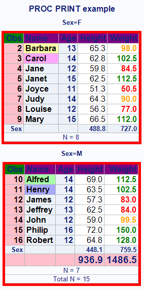

```
PROC FORMAT;
	VALUE $nfmt 
		'Alfred' = 'verylightgreen'
		'Henry' = 'verylightblue'
		'Barbara' = 'verylightyellow'
		'Carol' = 'verylightpurple';
	VALUE wfmt 
		LOW-85.99 = 'red'
		86-99.99 = 'orange'
		100-HIGH = 'green';
RUN;

PROC SORT DATA=sashelp.class OUT=classtest;
	BY sex;
RUN;

PROC PRINT DATA=classtest(FIRSTOBS=2 OBS=16) N
	STYLE(TABLE)      = {BACKGROUND=yellow RULES=rows FRAME=void CELLSPACING=0 BORDERCOLOR=red BORDERWIDTH=5}
	STYLE(HEADER)     = {BACKGROUND=purple FONT_SIZE=12pt}
	STYLE(GRANDTOTAL) = {BACKGROUND=pink FONT_SIZE=14pt}
	STYLE(OBS)        = {BACKGROUND=pink COLOR=BLACK FONT_SIZE=12pt}
	STYLE(OBSHEADER)  = {BACKGROUND=green FONT_SIZE=12pt};
	TITLE 'PROC PRINT example';
	VAR name   / STYLE(HEADER)=HEADER{FONT_SIZE=12pt} STYLE(DATA)=HEADER{FONT_SIZE=12pt BACKGROUND=$nfmt. FOREGROUND=black};
	VAR age    / STYLE(HEADER)=HEADER{FONT_SIZE=12pt} STYLE(DATA)=HEADER{FONT_SIZE=12pt};
	VAR height / STYLE(HEADER)=HEADER{FONT_SIZE=12pt} STYLE(DATA)={FONT_SIZE=12pt};
	VAR weight / STYLE(HEADER)=HEADER{FONT_SIZE=12pt} STYLE(DATA)={FONT_SIZE=12pt FOREGROUND=wfmt. FONT_WEIGHT=bold};
	BY sex;
	SUM height weight;
RUN; 
```



* `FIRSTOBS` is the first observation printed
* `OBS` is the last observation printed
* `N` prints the number of observations in the data set
* `BY` is to generate a table for each `BY` variable level (the data is expected to be ordered)
* `PAGEBY` is for creating page breaks using a variable
* `SUM` produces totaling variables (you will get a subtotal for each `BY` group in which there is more than one observation)
* You can print only certain variables or changing their order using `VAR`
* `FRAME=` defines the borders of the cells: `VOID` means no borders while `BOX` means all borders
