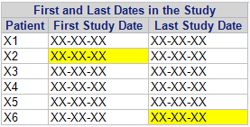

## Examples

### How to Write a Header/Footer in your Tables

```
ODS ESCAPECHAR='^';

PROC REPORT DATA=sashelp.cars;
	WHERE Make = 'Jaguar';
	COLUMN ('1) Label 1' model Invoice)
			('2) Label 2' Horsepower Weight Length);
	COMPUTE BEFORE _PAGE_ / STYLE=HEADER{JUST=L FONTWEIGHT=BOLD COLOR=PURPLE};
		LINE 'Test of custom header';
	ENDCOMP;
	COMPUTE AFTER / STYLE={TEXTDECORATION=UNDERLINE JUST=C COLOR=RED};
		LINE 'Test of a custom footer';
		LINE '^S={color=green} Test of a custom footer with a different style';
	ENDCOMP;
RUN;
```

### Specify the `STYLE` of Your Global Header

```
PROC REPORT DATA=SAS-data-set HEADSKIP HEADLINE NOWINDOWS STYLE(header)={ASIS=on BACKGROUND=very light grey FONTWEIGHT=BOLD};
	COLUMN ("Style of this global header" var1 var2);
	DEFINE var1 / DISPLAY 'Parameters' LEFT STYLE=[FONTWEIGHT=BOLD];
	DEFINE var2 / DISPLAY 'Values' CENTER;
RUN;
```

!!! summary "Check these websites"
    * [Beyond the Basics: Advanced `PROC REPORT` Tips and Tricks](http://support.sas.com/rnd/papers/sgf07/sgf2007-report.pdf)
    * [Creating a Plan for Your Reports and Avoiding Common Pitfalls in `REPORT` Procedure Coding](http://support.sas.com/resources/papers/proceedings13/366-2013.pdf)
    * [Turn Your Plain Report into a Painted Report Using ODS Styles](http://support.sas.com/resources/papers/proceedings10/133-2010.pdf)

### Specify the `STYLE` of a Cell Based on Other Cell's Value

```
PROC REPORT DATA=SAS-data-set NOWD;
	COLUMN timeinterval date1 date2;
	DEFINE timeinterval / DISPLAY NOPRINT; 
	DEFINE date1 / DISPLAY;
	DEFINE date2 / DISPLAY;
	COMPUTE date2;
		IF timeinterval lt 0 and timeinterval ne . then call define(_col_,"style","style={foreground=red font_weight=bold}");
		ELSE call define(_col_,"style","style={foreground=green font_weight=bold}");
	ENDCOMP;
RUN;
```

* `DEFINE` the variables involved in your conditional structure before the variable to which you want to apply the new format 
* `DEFINE` your variables as `DISPLAY NOPRINT` if you want to use them for the conditional structure but you don't want them to appear in your table

!!! tip
    Remember, `PROC REPORT` builds each row from left to right, so the value used as a condition to define the style must be to the left of the values whose style/format you want to change. 
    
```
data test;
	input flag pt $ firstdate $ lastdate $ ;
	datalines;
0 X1 XX-XX-XXXX XX-XX-XXXX
1 X2 XX-XX-XXXX XX-XX-XXXX
0 X3 XX-XX-XXXX XX-XX-XXXX
0 X4 XX-XX-XXXX XX-XX-XXXX
0 X5 XX-XX-XXXX XX-XX-XXXX
2 X6 XX-XX-XXXX XX-XX-XXXX
;
run;

proc report data=test nowindows headline style(header)={background=very light grey} missing split='*';
	column ("First and Last Dates in the Study" ('Patient' pt) ('First Study Date' firstdate) ('Last Study Date' lastdate) flag color1 color2);
	define pt / '' display order=internal;
	define firstdate / '' display;
	define lastdate / '' display;
	define flag / display noprint;
	define color1 / computed noprint;
	define color2 / computed noprint;

    compute color1;
        if flag eq 1 then call define('firstdate',"style","style={background=yellow}");
    endcomp;

    compute color2;
        if flag eq 2 then call define('lastdate',"style","style={background=yellow}");
    endcomp;
run;
```



### Control Output Table Width

If the margins of the page are defined

```
options topmargin=.98in bottommargin=.98in leftmargin=1.18in rightmargin=.98in;
```

and you 

```
proc report data=LEDDall2report_ago split='*' nowd colwidth=10 headline headskip missing spanrows style(report)={width=100%};
			column ("Dosis equivalente de levodopa diaria y número de fármacos de agonistas dopaminérgicos: descripción del cambio respecto a basal" ind texto param grupo1 grupo2 grupo3 grupo4 pvalor flag flag2);
			define ind / order noprint;
			define texto / '' style(column)=[width=7%];
			define param / '' style(column)=[width=5%];
			define grupo1 / "Visita 1 * (N=59)" style(column)=[width=5%];
			(...)
run;
``` 

### Introducing Line Breaks

To introduce line breaks in the **title or labels** you can use the `SPLIT=` option.

If you want to introduce a line break on the **variable's value** you need to define a `ODS ESCAPECHAR=` and use the `n` on your string as in the following example:

!!! Example
    ```
	DATA addy;
		INFILE DATALINES DLM='|';
		INPUT name ~$15. address ~$15. city $ state $;
		DATALINES;
	Debby Jones|1234 Johnny St|Chicago|IL
	Joe Smith|2345 Bobby Dr|New York|NY
	Ron Lee|3456 Suzy Ln|Miami|FL
	;
	RUN;

	ODS ESCAPECHAR='^';

	PROC REPORT DATA=addy SPLIT='~';
		COLUMN state city address name addblock;
		DEFINE state / DISPLAY NOPRINT ORDER=INTERNAL;
		DEFINE city / DISPLAY NOPRINT ORDER=INTERNAL;
		DEFINE address / DISPLAY NOPRINT ORDER=INTERNAL;
		DEFINE name / DISPLAY NOPRINT ORDER=INTERNAL;
		DEFINE addblock / COMPUTED 'Mailing~Address' FLOW WIDTH=30;

		COMPUTE addblock / CHAR LENGTH=40;
			addblock=CATX('^n',name,address,catx(', ',city,state));
		ENDCOMP;
	RUN;
    ```

You can also force line breaks in the **resulting tables** to better visualize the data.

```
PROC REPORT DATA=SAS-data-set NOWINDOWS HEADLINE STYLE(HEADER)={BACKGROUND=VERY LIGHT GREY} MISSING SPLIT='*';
	COLUMN ("Sample report" var1 var2 var3);
	DEFINE var1 / 'Label 1' GROUP ORDER=INTERNAL;
	DEFINE var2 / 'Label 2' DISPLAY;
	DEFINE var3 / 'Label 3' DISPLAY;

	* Introduce some line separations between var1 values;
	BREAK BEFORE var1 / SUMMARIZE STYLE=[BACKGROUND=VERY LIGHT GREY];
	* Avoid repeated labels;
	COMPUTE var2;
		 IF MISSING(_BREAK_) THEN var1=' ';
	ENDCOMP;
RUN;
```

!!! tip
    If the variable is numeric a `.` will apear in the break row. You need to create a format to assign `'            '` to `.`.
    If you describe the new value of `.` as `' '` your numbers will be truncated.
       
### Working with `ACROSS`

* Simple example:

```
PROC REPORT DATA=_AUX3 NOWINDOWS  
	HEADLINE STYLE(HEADER)={BACKGROUND=VERY LIGHT GREY} MISSING SPLIT='*';
	COLUMN("&&VAR&I (&&UNIT&I)" &TIMEVAR. ('STATISTICS' _LABEL_) &STRATAVAR., COL1);
	DEFINE _LABEL_ / '' GROUP ORDER=DATA;
	DEFINE &STRATAVAR./ '' ACROSS NOZERO ORDER=INTERNAL;
	/* NOZERO = SINCE ALL PRODUCT CATEGORIES WILL NOT BE REPRESENTED FOR EACH PRODUCT LINE IN THE TABLE */
	DEFINE &TIMEVAR./ '' F=&TIMEFMT. GROUP ORDER=INTERNAL; 
	DEFINE COL1/ '' GROUP;
RUN;
```

* Complex example:

```
proc report data=_data2report nowindows headline style(header)={background=very light grey} missing split='*';
	column("Lab tests (Hematology): normal, high abnormal and low abnormal results n(%)" lbtest trtgrpnum ('Value at * screening' clinsigSCR) ('Day 6' clinsig60, npctn60 _dummy) ('Early Termination Day' clinsigET, npctnET _dummy));
	define lbtest / '' group order=internal;
	define trtgrpnum/ '' group order=internal;
	define clinsigSCR / '' group order=internal;
	define clinsig60 / '' across nozero order=internal;
	define clinsigET / '' across nozero order=internal;
	* nozdero = since all product categories will not be represented for each product line in the table;
	define npctn60/ group '';
	define npctnET/ group '';
	define _dummy / computed noprint; /* This variable is created to avoid an error message */

	compute after/style=[just=L foreground=black FONT_SIZE=9pt];
		line "Table footer line 1";
		line "Table footer line 2";
	endcomp;

	* Introduce some line separations between arms of treatment;
	break after trtgrpnum / skip;
	* Introduce some line separations between tests;
	break before lbtest / summarize style=[background=very light grey FONT_WEIGHT=BOLD];
	* Avoid repeated labels;
	compute npctn60;
		if missing(_break_) then lbtest=' ';
	endcomp;
run;
```

!!! summary "Check these websites"
    * [Sailing Over the `ACROSS` Hurdle in `PROC REPORT`](https://www.sas.com/content/dam/SAS/support/en/technical-papers/SAS388-2014.pdf)
    
### Defining your own variables

There are two basic types of compute blocks; those that are **associated with a location** (the option `BEFORE` or `AFTER` follows the `COMPUTE` keyword), and those **associated only with a report item**. While the structure and execution of these two types of compute blocks is similar, how they are used and the timing of their execution can be quite different.

The compute block starts with the `COMPUTE` statement and terminates with the `ENDCOMP` statement. Usually the compute block is placed in the `REPORT` step after the `DEFINE` statements. The syntax of the compute block looks something like:

```
compute <location> <report_item> </ options>;
	one or more SAS language elements
endcomp;
````

The components of the `COMPUTE` statement include:

* **`location`** (`BEFORE` | `AFTER`): Specifies when the compute block is to execute and ultimately what is to be done with the result of the compute block.  When a location is specified without also specifying a report_item, the location will be at the start (`BEFORE`) or at the end (`AFTER`) of the report.
* **`report_item`**: When the result of the compute block is associated with a variable or report item, its name is supplied here. This `report_item` variable can be any variable on the `COLUMN` statement. When `report_item` is a variable that either groups or orders rows (usage of `GROUP` or `ORDER`) you may also use `BEFORE` and `AFTER` to apply the result at the start or end of each group. 
* **`options`**: Several options are available that can be used to determine the appearance and location of the result of the compute block.
* **`SAS language elements`**: Any number of SAS language elements can be used within the compute block. These include the use of executable statements, logical processing (`IF-THEN`/`ELSE`), and most of the functions available in the DATA step.

```
DEFINE obs / COMPUTED; 

COMPUTE obs;
	dsobs + 1;
	obs = dsobs;
ENDCOMPUTE;
```
