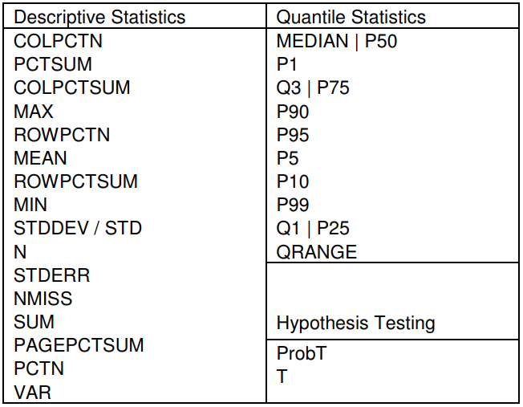
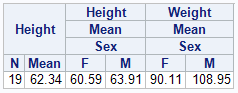

## ODS 

In order to produce outputs from SAS, the three more common `ODS` techniques, that produces different output files, are HTML, RTF, and PDF. Each `ODS` statement uses options that are specific to that destination. The `ODS` options (other than the `FILE=` option) used in the program are shown in the table below. 

|                   **RTF**             |                  **PDF**                   |     **HTML**        |
|:---------------------------------------:|:--------------------------------------------:|:--------------------:|
| `BODYTITLE` <br> `STARTPAGE=NO` <br> `KEEPN` <br> `NOTOC_DATA` / `TOC_DATA` <br> `CONTENTS` <br> `COLUMNS=` <br> `TEXT=` | `BOOKMARKGEN=NO` <br> `STARTPAGE=NO` <br> `COMPRESS=9` <br> `TEXT=` | `STYLE=SASWEB` <br> `RS=NONE` |

For an explanation of the options, refer to [this page](http://www2.sas.com/proceedings/forum2007/021-2007.pdf) or to the [`ODS` User's Guide](https://support.sas.com/documentation/cdl/en/odsug/69832/HTML/default/viewer.htm#titlepage.htm).

**Set the SAS system options.** The `NODATE` option suppresses the display of the date and time in the output. `PAGENO=` specifies the starting page number. `LINESIZE=` specifies the output line length, and `PAGESIZE=` specifies the number of lines on an output page.

```
OPTIONS NODATE PAGENO=1 LINESIZE=80 PAGESIZE=40;
```

## `PROC PRINT`

## `PROC TABULATE`

`PROC TABULATE` is a procedure that displays descriptive statistics in tabular format. It computes many statistics that other procedures compute, such as `MEANS`, `FREQ`, and `REPORT` and displays these statistics in a table format. `TABULATE` will produce tables in up to three dimensions and allows, within each dimension, multiple variables to be reported one after another hierarchically. There are also some very nice mechanisms that can be used to label and format the results. 

```
PROC TABULATE <options>;
	CLASS variables </ options>;
	VAR variables </ options>;
	TABLE <page>, <row>, column </ options>;
	... other statements...;
RUN;
```

* `VAR` is used to list the variables you intend to use to create summary statistics on. They **must be numeric**.
* `CLASS` variables allow you to get statistics by category. You will get one column/row for each value of the classification variable. You can also specify the universal CLASS variable `ALL` which allows you to **get totals**. They can be **either numeric or character** and you can only request counts and percents as statistics. This is almost like using a `BY`statement within the `TABLE`.
* `TABLE` consists of up to three dimension expressions and the table options. You can have multiple table statements in one `PROC TABULATE`. This will generate one table for each statement.
    * A **comma** specifies to add a new **dimension**. The order of the dimensions is page, row and column. If you only specify one dimension, then it is assumed to be column. If two are specified, row, then column.
    * The **asterisk** is used to produce a **cross tabulation** of one variable with another (within the same dimension however, different from `PROC FREQ`).
    * A **blank** is used to represent **concatenation** (i.e. place this output element after the preceding variable listed).
    * **Parenthesis** will **group elements** and associate an operator with each element in the group.
    * **Angle brackets** specify a **denominator definition** for use in percentage calculations. 
    
### Available Statistics

If you do not provide a statistic name, the default statistic produced will be `N` for the `CLASS` variables and `SUM` for the `VAR` variables.



### Single Dimensional Table 

```
PROC TABULATE DATA=sashelp.class;
	CLASS Sex;
	VAR Height Weight;
	TABLE Height * (N MEAN) Height * MEAN * Sex Weight * MEAN * Sex;
RUN; 
```



### Two Dimensional Table

You can get very different table structures by changing where the statistic definitions are placed. They can be attached to either the `VAR` or the `CLASS` variable, but the numbers in the cells will **always** be calculated using the `VAR` variable(s). 


The statistic specification can be **attached to the columns**,
```
PROC TABULATE data=sashelp.class;
	CLASS Sex;
	VAR Height Weight;
	TABLE Sex, Height * (N MEAN MAX) Weight * (N MEAN MAX) ;
RUN; 
```

")

or they can be **attached to the rows**.
```
PROC TABULATE data=sashelp.class;
	CLASS Sex;
	VAR Height Weight;
	TABLE Sex * (N MEAN MAX), Height  Weight;
RUN; 
```

")

You can specify **multiple classification variables**. They can be used in any of the dimensions and can be nested. When you have multiple `CLASS` variables, it is recommended to use the option `MISSING` to keep the observations that have any missing values and consider them as valid levels for the `CLASS` variable(s) instead of dropping those observations from all the tables.

```
PROC TABULATE DATA=sashelp.cars;
	CLASS DriveTrain Origin Type / MISSING;
	VAR Weight Length;
	TABLE Origin * Type, DriveTrain * Weight * MEAN DriveTrain * Length * MEAN;
RUN; 
```

")

### Examples

```
PROC TABULATE DATA=SAS-data-set ORDER=FREQ;
	VAR var1 var2;
	CLASS AEencoding;
	CLASS grade / ORDER=FORMATTED;
	CLASS treatment / ORDER=FORMATTED;
	TABLE AEencoding='', treatment='Treatment/Grade'*grade=''*(N='N' var1='%'*SUM='') ALL='Total (N=# cases)'*(N='N' var2='%'*SUM='') / BOX="Preferred MeDDRA Term";
RUN;
```

## `PROC REPORT`

How to write a header/footer in your tables:

```
ODS ESCAPECHAR='^';

PROC REPORT DATA=sashelp.cars;
	WHERE Make = 'Jaguar';
	COLUMN ('1) Label 1' model Invoice)
			('2) Label 2' Horsepower Weight Length);
	COMPUTE BEFORE _PAGE_ / STYLE=HEADER{JUST=L FONTWEIGHT=BOLD COLOR=PURPLE};
		LINE 'Test of custom header';
	ENDCOMP;
	COMPUTE AFTER / STYLE={TEXTDECORATION=UNDERLINE JUST=C COLOR=RED};
		LINE 'Test of a custom footer';
		LINE '^S={color=green} Test of a custom footer with a different style';
	ENDCOMP;
RUN;
```

Specify the `STYLE` of a cell based on other cell's value:

```
PROC REPORT DATA=SAS-data-set NOWD;
	COLUMN timeinterval date1 date2;
	DEFINE timeinterval / DISPLAY NOPRINT; 
	DEFINE date1 / DISPLAY;
	DEFINE date2 / DISPLAY;
	COMPUTE date2;
		IF timeinterval lt 0 and timeinterval ne . then call define(_col_,"style","style={foreground=red font_weight=bold}");
		ELSE call define(_col_,"style","style={foreground=green font_weight=bold}");
	ENDCOMP;
RUN;
```

* `DEFINE` the variables involved in your conditional structure before the variable to which you want to apply the new format 
* `DEFINE` your variables as `DISPLAY NOPRINT` if you want to use them for the conditional structure but you don't want them to appear in your table

Specify the `STYLE` of your global header:

```
PROC REPORT DATA=SAS-data-set HEADSKIP HEADLINE NOWINDOWS STYLE(header)={ASIS=on BACKGROUND=very light grey FONTWEIGHT=BOLD};
	COLUMN ("Style of this global header" var1 var2);
	DEFINE var1 / DISPLAY 'Parameters' LEFT STYLE=[FONTWEIGHT=BOLD];
	DEFINE var2 / DISPLAY 'Values' CENTER;
RUN;
```

!!! summary "Check these websites"
    * [Beyond the Basics: Advanced `PROC REPORT` Tips and Tricks](http://support.sas.com/rnd/papers/sgf07/sgf2007-report.pdf)
    * [Creating a Plan for Your Reports and Avoiding Common Pitfalls in `REPORT` Procedure Coding](http://support.sas.com/resources/papers/proceedings13/366-2013.pdf)
    * [Turn Your Plain Report into a Painted Report Using ODS Styles](http://support.sas.com/resources/papers/proceedings10/133-2010.pdf)
