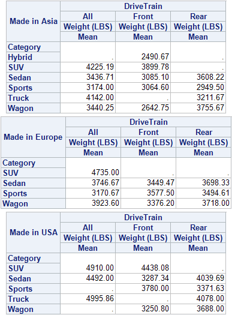

`PROC TABULATE` is a procedure that displays descriptive statistics in tabular format. It computes many statistics that other procedures compute, such as `MEANS`, `FREQ`, and `REPORT` and displays these statistics in a table format. `TABULATE` will produce tables in up to three dimensions and allows, within each dimension, multiple variables to be reported one after another hierarchically. There are also some very nice mechanisms that can be used to label and format the results. 

```
PROC TABULATE <options>;
	CLASS variables </ options>;
	VAR variables </ options>;
	TABLE <page>, <row>, column </ options>;
	... other statements...;
RUN;
```

* `VAR` is used to list the variables you intend to use to create summary statistics on. They **must be numeric**.
* `CLASS` variables allow you to get statistics by category. You will get one column/row for each value of the classification variable. You can also specify the universal CLASS variable `ALL` which allows you to **get totals**. They can be **either numeric or character** and you can only request counts and percents as statistics. This is almost like using a `BY`statement within the `TABLE`.
* `TABLE` consists of up to three dimension expressions and the table options. You can have multiple table statements in one `PROC TABULATE`. This will generate one table for each statement.
    * A **comma** specifies to add a new **dimension**. The order of the dimensions is page, row and column. If you only specify one dimension, then it is assumed to be column. If two are specified, row, then column.
    * The **asterisk** is used to produce a **cross tabulation** of one variable with another (within the same dimension however, different from `PROC FREQ`).
    * A **blank** is used to represent **concatenation** (i.e. place this output element after the preceding variable listed).
    * **Parenthesis** will **group elements** and associate an operator with each element in the group.
    * **Angle brackets** specify a **denominator definition** for use in percentage calculations (e.g. `pctn<variable>`).
    
!!! summary "Check these websites"
    * [`PROC TABULATE` and the Neat Things You Can Do With It](http://www2.sas.com/proceedings/forum2008/264-2008.pdf)
    
* `VARDEF=divisor` specifies the divisor to be used in the calculation of the variances. If divisor is `DF` (default), the degrees of freedom (N-1) are used as the divisor.
* `ORDER=` specifies the order of appearance in the table of the `CLASS` variable levels
    * `FORMATTED`: ordered by the formatted values
    * `DATA`: the order that the observations are read from the data set
    * `FREQ`: order the values so the one that occurs most frequently in the data set appears first
    * `INTERNAL`: ordered by the `SORT` procedure (defaults)
* `/CONDENSE` prints multiple logical pages on a single physical page
* `/PRINTMISS` species that row and column headings are the same for all logical pages of the table
* `/ROW = spacing` specifies whether all title elements in a row crossing are allotted space even when they are blank. When `ROW=CONSTANT` (or `CONST`), the default, all row title elements have space allotted to them; when `ROW=FLOAT`, the row title space is divided equally among the nonblank title elements in the crossing
    
## [Statistics that Are Available in `PROC TABULATE`](http://support.sas.com/documentation/cdl/en/proc/61895/HTML/default/viewer.htm#a000146762.htm)

If you do not provide a statistic name, the default statistic produced will be `N` for the `CLASS` variables and `SUM` for the `VAR` variables. Use the following keywords to request statistics in the `TABLE` statement or to specify statistic keywords in the `KEYWORD` or `KEYLABEL` statement.

!!! tip
    If a variable name (class or analysis) and a statistic name are the same, then enclose the statistic name in single quotation marks (for example, `'MAX'` ).

Descriptive statistic keywords:

* Percentages: `PCTN`, `COLPCTN`, `ROWPCTN`, `REPPCTN`, `PAGEPCTN`
* Additions: `SUM`, `SUMWGT`, `PCTSUM`, `COLPCTSUM`, `ROWPCTSUM`, `REPPCTSUM`, `PAGEPCTSUM`
* Elements: `N`, `NMISS`
* Basic statistics: `MEAN`, `STDDEV` | `STD`, `STDERR`, `MIN`, `MAX`, `RANGE`, `MODE`, `LCLM`, `UCLM`, `KURTOSIS` | `KURT`, `SKEWNESS` | `SKEW`
* Quantile statistics: `P1`, `P5`, `P10`, `Q1` | `P25`, `MEDIAN` | `P50`, `Q3` | `P75`, `P90`, `P95`, `P99`, `QRANGE`
* Hypothesis testing: `PROBT` | `PRT`, `T`
* Others: `CSS`, `CV`, `USS`, `VAR`
	
To compute standard error of the mean (`STDERR`) or Student's t-test, you must use the default value of the `VARDEF=` option, which is `DF`. The `VARDEF=` option is specified in the `PROC TABULATE` statement.

To compute weighted quantiles, you must use `QMETHOD=OS` in the `PROC TABULATE` statement.

Use both `LCLM` and `UCLM` to compute a two-sided confidence limit for the mean. Use only `LCLM` or `UCLM` to compute a one-sided confidence limit. Use the `ALPHA=` option in the `PROC TABULATE` statement to specify a confidence level.

## Single Dimensional Table 

```
PROC TABULATE DATA=sashelp.class;
	CLASS Sex;
	VAR Height Weight;
	TABLE Height * (N MEAN) Height * MEAN * Sex Weight * MEAN * Sex;
RUN; 
```


## Two Dimensional Table

You can get very different table structures by changing where the statistic definitions are placed. They can be attached to either the `VAR` or the `CLASS` variable, but the numbers in the cells will **always** be calculated using the `VAR` variable(s). 


The statistic specification can be **attached to the columns**,
```
PROC TABULATE data=sashelp.class;
	CLASS Sex;
	VAR Height Weight;
	TABLE Sex, Height * (N MEAN MAX) Weight * (N MEAN MAX) ;
RUN; 
```

")

or they can be **attached to the rows**.
```
PROC TABULATE data=sashelp.class;
	CLASS Sex;
	VAR Height Weight;
	TABLE Sex * (N MEAN MAX), Height  Weight;
RUN; 
```

")

You can specify **multiple classification variables**. They can be used in any of the dimensions and can be nested. When you have multiple `CLASS` variables, it is recommended to use the option `MISSING` to keep the observations that have any missing values and consider them as valid levels for the `CLASS` variable(s) instead of dropping those observations from all the tables.

```
PROC TABULATE DATA=sashelp.cars;
	CLASS DriveTrain Origin Type / MISSING;
	VAR Weight Length;
	TABLE Origin * Type, DriveTrain * Weight * MEAN DriveTrain * Length * MEAN;
RUN; 
```

")

In order to get **marginal statistics** in your table, you use the `ALL` keyword. You can use the keyword in multiple places and, depending on where you put the keyword, there will be different subtotals produced. 

```
PROC TABULATE DATA=sashelp.cars;
	CLASS DriveTrain Origin Type;
	TABLE (Origin All='Total') * (DriveTrain ALL='Subtotal DriveTrain'), (Type ALL='Subtotal Type'* N);
RUN; 
```

")

## Three Dimensional Table

Three dimensional tables have a nice way to fill in the upper left area. Instead of the label of the page dimension appearing above the table, you can use the `BOX=_page_` option to place that label inside the big white box.

```
PROC TABULATE data=sashelp.cars;
	CLASS DriveTrain Origin Type;
	VAR Weight Length;
	TABLE Origin = 'Made in', Type = 'Category', DriveTrain * Weight * MEAN / BOX=_PAGE_;
RUN; 
```



## Formatting tables

There are two ways to **add labels for your variables**:

1. Add the text after the variable name: `variable =‘label’`. This will work for both variables and
statistics.
2. Add a `LABEL` statement for variables and/or a `KEYLABEL` statement for statistics to your code:
```
LABEL var=‘label’;
KEYLABEL stat=‘label’;
```
In order to hide variable or statistic labels, you leave the label specification blank (`variable =‘ ’`). 

To **change the font color** of each variable you can define their style as in the following example:

```
PROC TABULATE DATA=sashelp.class;
   CLASS Age Sex;
   TABLES Age,
          Sex='Gender' *(N*{STYLE=[COLOR=Black]}
                  PCTN='Percent'   *{STYLE=[COLOR=Green]}
                  ROWPCTN='Row Percent'*{STYLE=[COLOR=Purple]}
                  COLPCTN='Column Percent' *{STYLE=[COLOR=Red]});
RUN;
```


* You can also **specify formats** for numbers in the cells of the table using the `variable-or-statistic*F=fmt.` expression.
* The `CLASSLEV` statement is used to assign some style attributes to the variable values only (not to the column header)
* The `NOSEPS` option **removes the horizontal dividers** between the row values from your table
```
PROC TABULATE DATA=SAS-data-set NOSEPS;
```
* `INDENT=` is used for subsetting row subheaders
* `RTS=` specifies how wide you want the row header field to be
* Use the `BOX=` option to **fill in the big white box in the upper left**
```
TABLE (...) / BOX={LABEL='Custom label for upper left box'} INDENT=3 RTS=12;
```

Depending on where you place the style options, many different results can be achieved. If you place the style options on the `PROC TABULATE` statement, for example, you will affect all the table cells. Note that for the `CLASS`, `CLASSLEV`, `VAR`, and `KEYWORD` statements, the style options can also be specified in the dimension expression in the Table statement. See below for a list of some of the different places where you can put the style options and what portion of the table they will affect.


```
PROC TABULATE DATA=SAS-data-set F=10.2 S=[custom style attributes]; 
	CLASS variable1 / S=[custom style attributes];
	CLASSLEV variable1 / S=[custom style attributes];
	VAR variable2;
	TABLE variable1='' all={label='Total' S=[custom style attributes], 
	      MEAN={S=[custom style attributes]} * variable2 
	      / BOX={LABEL='custom label' S=[custom style attributes]};
RUN;
```

!!! note "Possible style attributes"
    * Background color: `BACKGROUND=yellow` 
    * Foreground color: `FOREGROUND=black`
    * Font color: `COLOR=red`
    * Change font characteristics: `FONTt_WEIGHT`|`FONT_FACE`|`FONT_SIZE`
    * Vertical justification: `VJUST=B|C|T`
    * Horizontal justification: `JUST=R|C|L` 
    * Specify thickness of borders: `BORDERWIDTH=`
    * Change size of table cells: `CELLWIDTH=200`|`CELLHEIGHT=50`
    * Specify vertical and horizontal rule dividers: `RULES=none` (removes all ines from the table)
    * Specify white space around cell: `CELLSPACING=0` 
    * Specify thickness of spacing around cell: `CELLPADDING=10`
    * Specify width of table: `OUTPUTWIDTH=` 

## Dealing with Missing Values

### Force Missing Rows and Columns with `CLASSDATA`

When creating the same report over time, it is important that the format stays the same to ensure consistency. With the `TABULATE` procedure, **levels of a class variable, which do not have any observations, will not appear in the report**. To create consistent reports, a solution is needed that will ensure a standard report format over time. In order to account for changes that occur over time, all levels of class variables will need to be included in the standard report format. Creating a SAS data set with all levels of every class variable, along with declaring the `CLASSDATA` option in `PROC TABULATE`, will solve this problem. This paper shows how to set up the SAS data set to be used in conjunction with the `CLASSDATA` option, and how to avoid common errors that will cause `PROC TABULATE` to error out. The result is a **report format that will not change over time when the data changes over time**.

The basic syntax for of a `PROC TABULATE` that uses the `CLASSDATA` option is as follows:

```
PROC TABULATE DATA=SAS-data-set CLASSDATA=SAS-data-set <options>;
	CLASS variables </options>;
	VAR variables </options>;
	TABLE page, row, column </options>;
RUN;
```

Read [this article](http://support.sas.com/resources/papers/proceedings11/087-2011.pdf) for more information.

### How to Force Missing Values to Appear

Provided that the specific category is present (non-missing) at least in one of the variables in the `TABLE` statement, you can force the missing values to appear.

```
PROC TABULATE DATA=SAS-data-set ORDER=FREQ OUT=Output-SAS-data-set MISSING;
	CLASS var1 var2 crossvar;
	TABLE var1 var2, crossvar*(N COLPCTN) / PRINTMISS MISSTEXT='0';
RUN;
```

## Examples

```
PROC TABULATE DATA=SAS-data-set ORDER=FREQ;
	VAR var1 var2;
	CLASS AEencoding;
	CLASS grade / ORDER=FORMATTED;
	CLASS treatment / ORDER=FORMATTED;
	TABLE AEencoding='', treatment='Treatment/Grade'*grade=''*(N='N' var1='%'*SUM='') ALL='Total (N=# cases)'*(N='N' var2='%'*SUM='') / BOX="Preferred MeDDRA Term";
RUN;
```
