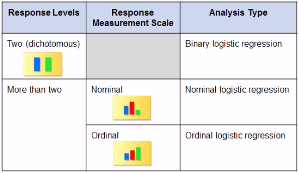
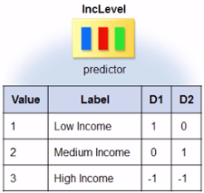
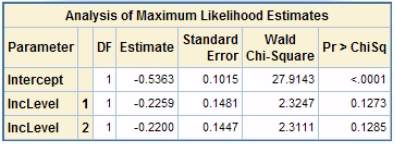
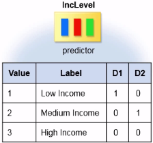
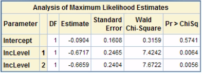

[Chapter summary in SAS](https://support.sas.com/edu/OLTRN/ECST131/m556/m556_5_a_sum.htm)

When you response variable is categorical, you need to use a different kind of regression analysis: **logistic regression**.

## Describing Categorical Data

When you examine the distribution of a **categorical variable**, you want to know the **values** of the variable and the **frequency or count** of each value in the data (**one-way frequency able**).

```
PROC FREQ DATA=SAS-data-set;
	TABLES variable1 variable2 variable3 </options>;
	<additional statements>
RUN;
```

To look for a possible **association** between two or more categorical variables, you can create a **crosstabulation**/**contingency table** (when it displays statistics for two variables is also called **two-way frequency able**).

```
PROC FREQ DATA=SAS-data-set;
	TABLES variable-rows*variable-columns </options>;
	<additional statements>
RUN;
```

Two distribution plots are associated with a frequency or crosstabulation table: a **frequency plot**, `PLOTS=(FREQPLOT)`, and a **cumulative frequency plot**.

In `PROC FREQ` output, the default order for character values is **alphaumeric**. To reorder the values of an ordinal variable in your `PROC FREQ` output you can:

* Create a **new variable** in which the values are stored in logical order
* Apply a [temporary format](https://support.sas.com/edu/OLTRN/ECST131/eclibjr/tempformat.htm) to the original variable
* How to [replace the variable's name with the variable's label in `PROC FREQ` output](http://support.sas.com/kb/23/350.html)

```
options validvarname=any;
PROC FREQ DATA=SAS-data-set (RENAME=(variable1="Label variable 1"n variable1="Label variable 1"n));
	TABLES "Label variable 1"n;
RUN;
```

* [Count the distinct values of a variable](http://support.sas.com/kb/36/898.html): The question of how to count distinct values of a `CLASS` or `BY` variable using either `PROC MEANS` or `PROC SUMMARY` is asked frequently. While neither of these procedures has this ability, `PROC SQL` can count these values using the `DISTINCT` option and `PROC FREQ` using the `NLEVELS` option.

## Tests of Association

### Pearson Chi-square Test

To perform a **formal test of association** between two categorical variables, you use the (Pearson) **chi-square test** which measures the difference between the observed cell frequencies and the cell frequencies that are expected if there is no association between variables ($H_0$ is true): 
$Expected=Row \ total\cdot Column\ total/Total \ sample \ size$

* If the **sample size decreases**, the **chi-square value decreases** and the **p-value for the chi-square statistic increases**
* Hypothesis testing: **$H_0$**: no association; **$H_a$**: association

### Cramer's V statistic

It is one **measure of strength of an association** between two categorical variables:

 * For two-by-two tables, Cramer's V is in the range of -1 to 1
 * For larger tables, Cramer's V is int he range of 0 to 1 
 * Values farther away from 0 indicate a relatively strong association between the variables

To measure the strength of the association between a binary predictor variable and a binary outcome variable, you can use an **odds ratio**: $Odds \ Ratio=\frac{Odds \ of \ Outcome \ in \ Group \ B}{Odds \ of \ Outcome \ in \ Group \ A}$; $Odds=p_{event}/(1-p_{event})$

 * The value of the odds ratio can range from 0 to $\infty$; it cannot be negative
 * When the odds ratio is 1 , there is no association between variables
 * When the odds ratio >1/<1, the group in the numerator/denominator is more likely to have the outcome
 * The odds ratio is approximately the same **regardless of the sample size**
 * To estimate the true odds ratio while taking into account the variability of the sample statistic, you can calculate **confidence intervals**
 * You can use an odds ratio to **test for significance** between two categorical variables
 * Odds ratio expressed as percent difference: $(odd \ ratio -1) \cdot 100$

```
PROC FREQ DATA=SAS-data-set;
	TABLES variable-rows*variable-columns / CHISQ EXPECTED </options>;
	<additional statements>
RUN;
```

* `CHISQ` produces the Pearson chi-square test of association, the likelihood-ratio chi-square and the Mantel-Haenszel: $\sum \frac{(obs. \ freq. - exp. \ freq.)^2}{exp. \ freq.}$
* `EXPECTED` prints the expected cell frequencies
* `CELLCHI2` prints each cell's contribution to the total chi-square statistic: $ \frac{(obs. \ freq. - exp. \ freq.)^2}{exp. \ freq.}$
* `NOCOL`/`NOROW` suppresses the printing of the column/row percentages
* `NOPERCENT` supresses the printing of the cell percentages
* `RELRISK` (relative risk) prints a table that contains risk ratios (probability ratios) and odds ratios; `PROC FREQ` uses the **classification in the first column** of the crosstabulation table as the **outcome of interest** and the first/second row in the numerator/denominator

### Mantel-Haenszel chi-square test

For **ordinal associations**, the **Mantel-Haenszel** chi-square test is a more powerful test.

* The levels must be in a **logical order** for the test results to be meaningful
* Hypothesis testing: **$H_0$**: no ordinal association; **$H_a$**: ordinal association
* Similarly to the Pearson case, the Mantel-Haenszel chi-square statistic/p-value indicate whether an association exists but not its magnitude and they depend on and reflect the sample size

To measure the **strength of the association** between two ordinal variables you can use the **Spearman correlation** statistic.

* You should only use it if both variables are ordinal and are in logical order
* Is considered to be a rank correlation because it provides a degree of association between the ranks of the ordinal variables
* This statistic has a **range between -1 and +1**: values close to -1/+1 indicate that there is a relatively high degree of negative/positive correlation and values close to 0 indicate a weak correlation
* It is **not affected by the sample size**

```
PROC FREQ DATA=SAS-data-set;
	TABLES variable-rows*variable-columns / CHISQ EXPECTED </options>;
  <additional statements>
RUN;
```

* `MEASURES` produces the Spearman correlation statistic along with other measurement of association
* `CL` produces confidence bounds for the statistics that the MEASURES option requests
* The confidence bounds are valid only if the sample size is large (>25)
* The asymptotic standard error (**ASE**) is used for large samples and is used to calculate the confidence intervals for various measures of association (including the Spearman correlation coefficient)

## Introduction to Logistic Regression

Logistic Regression is a generalized linear model (like Linear Regression or ANOVA) that you can use to predict a categorical response/outcome based on one or more continuous/categorical predictor variables. There are three models:



### Linear vs Logistic

#### Linear Regression Model

* Assumes that the expected value of the response continuous variable ($Y$) has a linear relationship with the predictor variable ($X$)
* The conditional mean of the response hast the linear form $E(Y|X)=\beta_0+\beta_1X$ and it ranges $(-\infty,+\infty)$

!!! fail "Why not to use Linear Regression to model a binary response variable"
    
    Following the Linear Regression Model scheme, the response variable is calculated as 

    $Y_i=\beta_0+\beta_1\cdot X_i+\epsilon_i$, 

    where $\beta_0$ and $\beta_1$ are obtained by the method of least squares. 

    * This model **assumes that the data is continuous**, which is not true for the case of binary data
    * This model **assumes that the mean of the response is $\beta_0+\beta_1\cdot X$**, while for binary data the mean of the response is the probability of a success
    * If the response variable has only two levels, you cannot **assume the constant variance and normality** that are required for linear regression

#### Binary Logistic Regression Model

* The predictor variable ($X$) is used to estimate the probability of a specific outcome ($p$) for which you need to use a nonlinear function
* The mean of the response is a probability, which is between $(0, 1)$. 
* The **Inverse Logit Function** binds the linear predictor between $0$ and $1$ is defined as $p_i=(1+e^{-(\beta_0+\beta_1 X_i)})^{-1}$
* This model applies a **Logit Transformation** to the probabilities $logit(p_i)=ln\left ( \frac{p_i}{1-p_i} \right ) = \beta_0+\beta_1X_i$, so that the transformed probabilities and predictor variables end up with a linear relationship
* The logit is the **natural log of the odds** (the probability of the event occurring divided by the probability of the event not occurring)
* We make the **assumption that the logit transformation of the probabilities results in a linear relationship with the predictor variables** (we can use a linear function $X$ to model the logit in order to indireclty model the probability)
* The logit of the probability transforms the probability into a linear function, which has no lower or upper bounds. So a **logit has no lower or upper bounds**.

### `PROC LOGISTIC`

To model categorical data yu use the `LOGISTIC` procedure. Some of the most common statements of this procedure are shown here:

```hl_lines="1 3"
PROC LOGISTIC DATA=SAS-data-set <options>;
	CLASS variable <(variable_options)> ... </ options>;
	MODEL response <(variable_options)> = predictors </ options>;
	UNITS independent1=list... </ options>;
	ODDSRATIO <'label'> variable </ options>;
RUN;
```

* `CLASS` is used to define the classification (categorical) predictor variables (if any); this statement must precede the `MODEL` statement
* `CLODDS = PL` (profile likelihood) | `WALD` (default) | `BOTH` is an example of a general option that you can specify in the `MODEL` statement which computes confidence intervals for the odds ratios of all predictor variables and also enables the production of the odds ratio plot

!!! tip "Example"
	```
	PROC LOGISTIC DATA=statdata.sales_inc PLOTS(ONLY)=(EFFECT ODDSRATIO);
	    CLASS gender;
	    MODEL purchase(EVENT='1')=gender / CLODDS=PL;
	RUN;
	```

### Classification Variables Parametrization

When the predictor variable is categorical, the assumption of linearity cannot be met. To get past the obstacle of nonlinearity, the `CLASS` statement creates a set of one or more **design variables** (also called dummy variables). `PROC LOGISTIC` uses these variables, and not the original ones, in model calculations.

Different parametrization methods for the classification variables will produce the same results regarding the significance of the categorical predictors, but understanding the parametrization method helps to interpret the results accurately.

Here we present two of the most common methods of parameterizing (`PARAM =`) the classification variables. For both of them:

* The default **reference level** is the level that has the highest ranked value (or the last value) when the levels are sorted in ascending alphanumeric order
* The number of design variables (or $\beta$) that are created are the number of levels of the classification variable -1

#### Effect coding (default) 

Also called **deviation from the mean coding**, it compares the effect of each level of the variable to the **average effect of all levels**. 

!!! tip "Example"
	Using this parametrization scheme the model will be described as follows

	$logit(p)=\beta_0+\beta_1\cdot D_{Low \\ Income} + \beta_2\cdot D_{Medium \\ Income}$
	
	

    * $\beta_0$ is the average value of the logit across all income levels
    * $\beta_1$ is the difference between the logit for income level 1 and $\beta_0$
    * $\beta_2$ is the difference between the logit for income level 2 and $\beta_0$

    Here's the Analysis of Maximum Likelihood Estimates table that `PROC LOGISTIC` generates for this example on which the parameter estimates ($\beta_0$, $\beta_1$, $\beta_2$) and p-values reflect differences from the overall mean value over all levels. 

    

    The p-values indicate whether each particular level is significant compared to the average effect of all levels. The p-values for $\beta_1$ and $\beta_2$ not significant meaning that the effect of those levels is not different than the average effect of low, medium and high income.

#### Reference cell coding

It compares the effect of each level of the predictor to the effect of another **level that is the designated reference level**.

!!! tip "Example"
	To use this scheme the classification variable has to be defined in the following way

	`CLASS gender (PARAM=REF REF='Male');`

	Using this parametrization scheme the model will be described as follows

	$logit(p)=\beta_0+\beta_1\cdot D_{Low \\ Income} + \beta_2\cdot D_{Medium \\ Income}$
	
	

    * $\beta_0$ is the intercept, but not in terms of where you cross the $Y$ axis, instead is the value of the logit of the probability when income is high (or at the reference level)
    * $\beta_1$ is the difference between the logit of the probability for low and high income
    * $\beta_2$ is the difference between the logit of the probability for medium and high income

    Here's the Analysis of Maximum Likelihood Estimates table that `PROC LOGISTIC` generates for this example on which the parameter estimates ($\beta_0$, $\beta_1$, $\beta_2$) and p-values reflect differences with respect to the reference level. 

    

    The p-values indicate whether each particular level is significant compared to the reference level. The p-value for $\beta_1<0.05$ is significant meaning that the effect of a low income is statistically different than the effect of a high income on the probability that people will spend at least $100\$$. The same applies to $\beta_2$.

### Fitting a Binary Logistic Regression 

```
PROC LOGISTIC DATA=statdata.sales_inc PLOTS(ONLY)=(EFFECT);
	CLASS Gender (PARAM=REF REF='Male');
	MODEL Purchase(event='1') = Gender;
	title1 'LOGISTIC MODEL (1): Purchase = Gender';
RUN;
```

We look at the first few tables to make sure that the model is set up the way we want

* The **Model Information** table describes the data set, the response variable, the number of response levels, the type of model, the algorithm used to obtain the parameter estimates, and the number of observations read and used.
* The **Response Profile** table shows the values of the response variable, listed according to their ordered value and frequency. By default, `PROC LOGISTIC` orders the values of the response variable alphanumercally and bases the logistic regression model on the probability of the lowest value. However, we set the `EVENT=1`, the highest value, so this model is based on the probability that `Purchase=1`.
* Below this table, we see the probability that `PROC LOGISTIC` is modeling, as shown in the log.
* The **Class Level Information** table displays the predictor variable in the `CLASS` statement `Gender` (in the model we fixed `'Male'` as the reference level, so the design variable is 1 when `Gender='Female'` and 0 when `Gender='Male'`).
* The **Model Convergence Status** simply indicates that the convergence criterion was met. There are a number of options to control the convergence criterion, but the default is the gradient convergence criterion with a default value of $10^{-8}$.
* The **Model Fit Statistic** table reports the resuls of three tests (for the model with the intercept only and the model with the intercept and the predictor variables): AIC, SC and -2$\cdot$Log(likelihood). AIC and SC are **goodness-of-fit measures** that you can use to compare one model to another (lower values indicate more desirable model) and are not dependent on the number of terms in the model.
	* **Akaike's Information Criterion (AIC)**: it adjusts for the number of predictor valriables. It is the best statitstic to come up with the best **explanatory model**.
	* **Schwarz's Bayesian Criterion (SC)**: it adjusts for the number of predictor variables and the number of observations. This test uses a bigger penalty for extra variables and therefore favors more parsimonious models. It is the best statitstic to come up with the best **predictive model**.
* The **Testing Global Null Hypothesis: BETA=0** table provides three statistics to test $H_0$ that all the regression coefficients in the model are 0. The **Likelihood Ratio** is the most reliable test, specially for small sample sizes. It is similar to the overall F test in linear regression.
* The **Type 3 Analysis of Effects** table is generated when `CLASS` specifies a categorical predictor variable. The **Wald Chi-Square** statistic tests the listed effect. When there is only one predictor variable in the model, the value listed in the table will be idential to the Wald test in the **Testing Global Null Hypothesis** table.
* The **Analysis of Maximum Likelihood Estimates** table lists the estimated model parameters, their standard errors, Wald test statistics and corresponding p-values. The parameter estimates are the estimated coefficients of the fitted logistic regression model. We can use these estimates to construct the logistic regression equation $logit(\beta)=\beta_0+\beta_1 \cdot Categorical \ predictor$.
* The **Odds Ratio Estimates** table shows the OR ratio for the modeled event. Notice that `PROC LOGISTIC` calculates Wald confidence limits by default.
* The **Association of Predicted Probabilities and Observed Responses** table lists several goodness-of-fit measures.
* The **Effect plot** shows the levels of the `CLASS` predictor variable vs the probability of the desired outcome. 

#### Iterpreting the Odds Ratio for a Categorical Predictor

Let's see how to calculate the odds and the odds ratio from the logistic regression model. Here is the logistic regression model that predicts the logit of $p$:

$logit(\hat p)=ln(odds)=ln\left ( \frac{p_i}{1-p_i} \right )=\beta_0 + \beta_1 \cdot Gender$

According to our example the variable `Gender` is codified in a way that `Females=1` and `Males=0`, so the OR can be written:

$odds_{females}=e^{\beta_0+\beta_1}$

$odds_{males}=e^{\beta_0}$

$odds \ ratio = \frac{e^{\beta_0+\beta_1}}{e^{\beta_0}}=e^{\beta_1}$

If the 95% confidence interval does not include 1, the OR is significant at the 0.05 level indicating an association between the predictor and response variables of your model.

#### Iterpreting the Odds Ratio for a Continuous Predictor

For a continuous predictor variable, the OR measures the **increase or decrease in odds associated with a one-unit difference** of the predictor variable by default. $OR - 1 = %$ of greater odds for having one-unit of difference.

#### Comparing Pairs to Assess the Fit of a Logistic Regression Model

`PROC LOGISTIC` calculates several different goodness-of-fit measures and displayed in the **Association of Predicted Probabilities and Observed Responses** table.

One of these goodness-of-fit methods is comparing pairs (`Pairs`). To start, `PROC LOGISTIC` creates two groups of observations, one for each value of the response variable. Then, the procedure selects pairs of observations, one from each group, until no more pairs can be selected. `PROC LOGISTIC`determines whether each pair is concordant, discordant or tied.

* A pair is **concordant** if the **model predicts it correclty**, i.e. if the observation with the desired outcome has a **higher predicted probability**, based on the model, than the observation without the outcome.
* A pair is **discordant** if the **model does not predict it correctly**, i.e. if the observation with the desired outcome has a **lower predicted probability**, based on the model, than the observation without the outcome.
* A pair is **tied** if it is neither concordant not discordant, i.e. the **probabilities are the same** and the model can not distinguished between them.

The left column of the **Association of Predicted Probabilities and Observed Responses** table lists the percentage of pairs of each type. At the bottom is the total number of observation pairs on which the percentages are based, i.e. the number of pairs of observations with different outcome values $(N_{event=0} \cdot N_{event=1})$.

More complex models have more than two predicted probabilities. However, regardless of the model's complexity, the same comparisons are made across all pairs of observations with different outcomes.

You can use these results as goodness-of-fit measures to compare one model to another. In general, higher percentage of concordant pairs and lower percentages of discordant and tied pairs indicate a more desirable model.

This table also shows the four rank correlation indices that are computed from the numbers of concordant $(n_c)$, discordant $(n_d)$ and tied $(n_t)$ pairs of observations:

* **`Somers' D` (Gini coefficient)**, defined as $(n_c-n_d)/(n_c+n_d+n_t)$
* **Goodman-Kruskal `Gamma`**, defined as $(n_c-n_d)/(n_c+n_d)$
* **Kendall's `Tau-a`**, defined as $(n_c-n_d)/(0.5 \cdot N(N-1))$, with $N$ being the sum of observation frequencies in the data
* **The concordance index `c`** is the most commonly used of these values and estimates the probability of an observation with the desired outcome having a higher predicted probability than an observation without the desired outcome and is defined as $c=\frac{n_c+0.5 \cdot n_t}{n_c+n_d+n_t}$. Note that the concordance index, c, also gives an estimate of the **area under the receiver operating characteristic (ROC) curve** when the response is binary.

!!! note
	More information about these parameters [here](http://support.sas.com/documentation/cdl/en/statug/66859/HTML/default/viewer.htm#statug_logistic_details22.htm).

In general, a model with higher values of these indices has better predictive ability than a model with lower values.


## Multiple Logistic Regression Model


* Identifying the use and types of logistic regression
* Fitting a binary logistic regression model using the `LOGISTIC` procedure
* Explaining effect and reference cell coding for classification variables
* Explaining the standard output from the `LOGISTIC` procedure