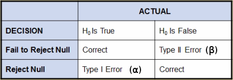

[Chapter summary in SAS](https://support.sas.com/edu/OLTRN/ECST131/m551/m551_6_a_sum.htm)

## Basic Statistical Concepts

***Descriptive statistics (exploratory data analysis, EDA)***

* Explore your data

***Inferential statistics (explanatory modelling)***

* **How is X related to Y?**
* Sample sizes are typically small and include few variables
* The focus is on the parameters of the model
* To assess the model, you use p-values and confidence intervals

***Predictive modelling***

* **If you know X, can you predict Y?**
* Sample sizes are large and include many predictive (input) variables
* The focus is on the predictions of observations rather than the parameters of the model
* To assess a predictive model, you validate predictions using holdout sample data
 
---

* **Parameters**: numerical values (typically unknown, you can't measure the entire population) that summarize characteristics of a population (greek letters)
* **Statistics**: summarizes characteristics of a sample (standard alphabet)
* You use **statistics** to estimate **parameters**

---

* **Independent variable**: it can take different values, it affects or determines a **dependent variable**. It can be called predictor, explanatory, control or input variable.
* **Dependent variable**: it can take different values in response to an **independent variable**. Also known as response, outcome or target variable.

---

***Scale of measurement***: variable's classification

* **Quantitative/numerical variables**: counts or measurements, you can perform arithmetical operations with it
    * **Discrete data**: variables that can have only a countable number of values within a measurement range
    * **Continuous data**: variables that are measured on a scale that has infinite number of values and has no breaks or jumps
        * **Interval scale data**: it can be rank-ordered like ordinal data but also has a sensible spacing of observations such that differenes between measurements are meaningful but it lacks a true zero (ratios are meaningless)
        * **Ratio scale data**: it is rank-ordered with meaningful spacing and also includes a true zero point and can therefore accurately indicate the ratio difference between two spaces on the measurement scale
* **Categorical/attribute variables**: variables that denote groupings or labels
    * **Nominal data (qualitative/classification variable)**: exhibits no ordering within its observed levels, groups or categories
    * **Ordinal data**: the observed labels can be ordered in some meaningful way that implies that the differences between the groups or categories are due to magnitude

---

* **Univariate analysis** provides techniques for analyzing and describing a sigle variable. It reveals patterns in the data by looking at the **range** of values, measures of **dispersion**, the **central tendecy** of the values and **frequency distribution**.
* **Bivariate analysis** describes and explains the relationships between two variables and how they change or covary together. It include techniques such as **correlation analysis** and **chi-square tests of independance**.
* **Multivariate/Multivariable analysis** examines two or more variables at the same time in order to understand the relationships among them. 
    * Techniques such as **mutiple linear regression** and n-way **ANOVA** are typically called **multivariable** analysis (only one response variable). 
    * Techniques such as **factora analysis** and **clustering** are typically called **mutivariate** analysis (they consider more than one response variable).

---

***Descriptive Statistics***

**Measures of central tendencies**: mean (affected by outliers), median (less sensitive to outliers), mode

| Percentile | Quartile |  | 
| :------------: | :-------------: | :-------------: |
| 25th | 1st / lower / Q1 | |
| 50th | 2nd / middle / Q2 | Median
| 75th | 3rd / upper / Q3 | |

The **interquartile range (IQR)** is the difference between Q1 and Q3, it is a **robust estimate of the variability** because changes in the upper/lower 25% of the data do not affect it. If there are **outliers** in the data, then the IQR is a more reliable measure of the spread than the overall range.

The **coefficient of variation (CV)** is a measure of the standard deviation expressed as a percentage of the mean ($c_v = \sigma / 100 \mu$).

---

***Normal distribution***

| Intervals | Percentage contained |  
| :------------: | :-------------: | 
| $\mu \pm \sigma$ | 68% | 
| $\mu \pm 2 \sigma$ | 95% | 
| $\mu \pm 3 \sigma$ | 99% | 

*How to check the normality of a sample?*

* Compare the **mean** and the **median**: if they are nearly equal, that is an indicator of symmetry (requirement for normality)
* Check that **skewness** and **kurtosis** are close to 0:
    * If both are greater than 1 or less than -1: data is not normal
    * If either is greater than 2 or less than -2: data is not normal

*Statistical summaries* 

**Skewness** and **kurtosis** measure certain aspects of the shape of a distribution (they are **0** and **3** for a normal distribution, although SAS has standardized both to 0)

* **Skewness** measures the tendency of your data to be more spread out on one side of the mean than on the other (asymmetry of the distribution). 
    * You can think of the direction of skewness as the direction the data is trailing off to. 
    * A **right-skewed** distribution tells us that the mean is **greater than the median**.
* **Kurtosis** measures the tendency of your data to be concentrated toward the center or toward the tails of the distribution (peakedness of the data, tail thickness). 
    * A **negative kurtosis (platykurtic distribution)** means that the data has lighter tails than in a normal distribution. 
    * A **positive kurtosis (leptokurtic/heavy-tailed/outlier-prone distribution)** means that the data has heavier tails and is more concentrated around the mean than a normal distribution.
    * Rectangular, bimodal and multimodal distributions tend to have low values of kurtosis.
    * **Asymmetric distributions** also tend to have nonzero kurtosis. In these cases, understanding kurtosis is considerably more complex and can be difficult to assess visually.


---

### `PROC SURVEYSELECT`

How to generate random (representative) samples (population subsets):

```
PROC SURVEYSELECT DATA=SAS-data-set 
                  OUT=name-of-output-data-set
                  METHOD=method-of-random-sampling
                  SEED=seed-value 
                  SAMPSIZE=number-of-observations-desired;
     <STRATA stratification-variable(s);>
RUN;
```

* `METHOD` specifies the random sampling method to be used. For simple random sampling without replacement, use `METHOD=SRS`. For simple random sampling with replacement, use `METHOD=URS`. For other selection methods and details on sampling algorithms, see the SAS online documentation for `PROC SURVEYSELECT`.
* `SEED` specifies the initial seed for random number generation. If no `SEED` option is specified, SAS uses the system time as its seed value. This creates a different random sample every time the procedure is run.
* `SAMPSIZE` indicates the number of observations to be included in the sample. To select a certain fraction of the original data set rather than a given number of observations, use the `SAMPRATE` option.


## Picturing Your Data

### `PROC UNIVARIATE` 
Plots that can be produced with this procedure:

* **Histograms**
* **Normal probability plots**: expected percentiles from standard normal vs actual data values


### `PROC SGSCATTER` 
Plots that can be produced with this procedure:

* **Scatter plots**: you can create a **single-cell** (simple Y by X) scatter plot, a **multi-cell** scatter plot with multiple independent scatter plots in a grid and a **scatter plot matrix**, which produces a matrix of scatter plots comparing multiple variables.

### `PROC SGPLOT` 
Plots that can be produced with this procedure:

```
PROC SGPLOT DATA=SAS-data-set <options>;
        DOT category-variable </options>;
        HBAR category-variable </options>;
        VBAR category-variable </options>;
        HBOX response-variable </options>;
        VBOX response-variable </options>;
        HISTOGRAM response-variable </options>;
        SCATTER X=variable Y=variable </options>;
        NEEDLE X=variable Y=numeric-variable </options>;
        REG X=numeric-variable Y=numeric-variable </options>;
RUN;
```

Anywhere in the procedure you can add **reference lines**:<br>
```
REFLINE variable | value-1 <... value-n> </option(s)>

/* Example: */
REFLINE 1200 / axis=y lineattrs=(color=blue);
```

!!! note
    The order on which you define the parts of the plot will the determined the order on which it is displayed (if you want to send a `REFLINE` to the back, define it first)

* **Scatter plots (`SCATTER`)**
* **Line graphs**
* **Histograms (`HISTOGRAM`)** with overlaid distribution curves
* **Regression lines (`REG`)** with confidence and prediction bands
* **Dot plots (`DOT`)**
* **Box plots (`HBOX`/`VBOX`)**: it makes it easy to see how spread out your data is and if there are any outliers. The box represents the middle 50% of your data (IQR). The lower/middle/upper **line of the box** represent Q1/Q2/Q3. The **diamond** denotes the mean (easy to check how close the mean is to the median). The **whiskers** extend as far as the data extends to a maximum length of 1.5 times the IQR above Q3. Any data points farther than this distance are considered possible outliers and are represented in this plot as **circles**.
* **Bar charts (`HBAR`/`VBAR`)**
* **Needle plot (`NEEDLE`)**: creates a plot with needles connecting each point to the baseline
* You can also **overlay plots together** to produce many different types of graphs

### `PROC SGPANEL` 
Plots that can be produced with this procedure:

* **Panels of plots** for different levels of a factor or several different time periods depending on the classification variable
* **Side-by-side histograms** which provide a visual comparison for your data

### `PROC SGRENDER` 

* **Plots from graphs templates you have modified or written yourself**

---

To specify options for graphs you submit the `ODS GRAPHICS` statement:

```
ODS GRAPHICS ON <options>;
```

* To select/exclude specific test results, graphs or tables from you output, you can use `ODS SELECT` and `ODS EXCLUDE` statements.
* You can use ODS templates to modify the layout and details of each graph
* You can use ODS styles to control the general appearance and consistency of yous graphs and tables (by default **HTMLBLUE**).

Another way to control your output is to use the **PLOTS** option which is usually available in the procedure statement:
```
PROC UNIVARIATE DATA=SAS-data-set PLOTS=options;
```
This option enables you to specify which graphs SAS should create, either in addtion or instead of the default plots.

## Confidence Intervals for the Mean

* A **point estimator** is a sample statistic used to estimate a population parameter
* An estimator takes on different values from sample to sample, so it's important to know its variance
* A statistic that measures the variability of your estimator is the **standard error**
* It differs from the standard deviation: the **standard deviation** deals with the variability of your data while **standard error** deals with the variability of you sample statistic

**E.g.:** $standard \\ error \\ of \\ the \\ mean = standard \\ deviation/ \sqrt{sample \\ size}$

The **distribution of sample means** is always less variable than the data.

* Because we know that point estimators vary from sample to sample, it would be nice to have an estimator of the mean that directly accounts for this natural variability
* The **interval estimator** gives us a range of values that is likely to contain the population mean
* It is calculated from the **standard error** and a value that is determined by the **degree of certainty** we require (**significance level**)
* **Confidence intervals** are a type of interval estimator used to estimate the population mean
* You can make the confidence interval narrower by increasing the sample size and by decreasing the confidence level

<center>$CI = sample \\ mean \pm quantile \cdot standard \\ error$</center>

* The `CLM` option of `PROC MEANS` calculates the confidence limits for the mean, you can add `ALPHA=` to change the default 0.05 value for a 95% confidence level
* The **central limit theorem** states that the distribution of sample means is approximately normal regardless of the population distribution's shape, if the sample size is large enough (~30 observations)

## Hypothesis Testing

* The **null hypothesis** ($H_0$) is what you assume to be true when you start your analysis
* The **alternative hypothesis** ($H_a$ or $H_1$) is your initial research hypothesis, that is, your proposed explanation

Decision-making process:

1. Define null and alternative hypothesis
2. Specify significance level (type I error rate)
3. Collect data
4. Reject or fail to reject the null hypothesis



* The type I and II errors are **inversely related**: as one type increases the other decreases 
* The **power** is the probability of a **correct rejection** = 1 - &beta;
 * It is the ability of the statistical test to detect a true difference
 * It is the ability to successfully reject a false null hypothesis
 

* A **p-value** measures the probability of observing a value as extreme as the one observed
    * The p-value is used to determine **statistical significance**
    * It helps you assess whether you should reject the null hypothesis
* The **p-value** is affected by:
    * The **effect size**: the difference between the observed statistic and the hypothesized value
    * The **sample size**: the larger the sample size, the more sure you are about the sample statistics, the lower the p-value is
 
 
* A reference distribution enables you to quantify the probability (p-value) of observing a particular outcome (the calculated sample statistic) or a more extreme outcome, if the nul hypothesis is true
* Two common reference distributions for statistical hypothesis testing are the **t distribution** and the **F distribution**
* These distributions are characterized by the **degrees of freedom** associated with your data
* The **t distribution** arises when you're making inferences about a population mean and the population standard deviation is unknown and has to be estimated from the data
    * It is **approximately normal** as the **sample size grows larger**
    * The t distribution is a **symmetric distribution** like the normal distribution except that the t distribution has **thicker tails**
    * The **t statistic** is positive/negative when the sample is more/less than the hypothesized mean
    * If the data doesn't come from a normal distribution, then the t statistic approximately follows a t distribution as long as the sample size is large (**central limit theorem**)
 
Calculation with `PROC UNIVARIATE`:

```
ODS SELECT TESTSFORLOCATION;
PROC UNIVARIATE DATA=SAS-data-set MU0=number alpha=number;
  VAR variable(s);
  ID variable_to_relate;
  HISTOGRAM variables </options>;
  PROBPLOT variables </options>;
  INSET keywords </options>;
RUN;
```

* `TESTSFORLOCATION` displays only the p-values calculation
* By default `MU0 = 0`
