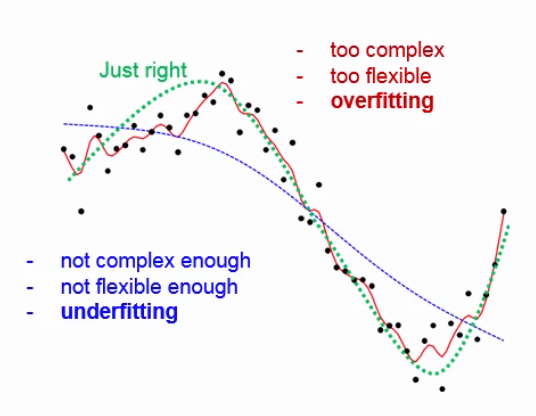
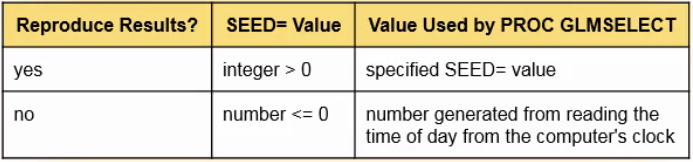

[Chapter summary in SAS](https://support.sas.com/edu/OLTRN/ECST131/m555/m555_3_a_sum.htm)

Inferential models, such as ANOVA and linear regression, are used to test hypotheses about the data and characterize the relationships between various types of predictor variables and a response variable. But, what if you want to go beyond explaining the relationship and **predict future values of the response variable**?

In predictive modeling, a statistical model is used to predict future values of a response variable, based on the existing values of predictor variables. In predictive modeling, the terms used to refer to the variables are often different from the terms used in explanatory modeling:

* Predictors are often called inputs, features, explanatory variables or independent variables 
* The response variable is often called a target, an outcome or dependent variable

In predictive modeling, the inputs and the target can be continuous, categorical, binary or any combination of these types.

## Introduction to Predictive Modeling

Before you can predict values, you must first build a predictive model. To build a predictive model, you can use `PROC GLMSELECT`.

* Describe the goal and uses of predictive modeling
* Explain how data partitioning is used in the hones assessment method of model selection
* Describe the relationship between model complexity and flexibility
* Use `PROC GLMSELECT` to build a predictive model

### What Is Predictive Modeling?

Predictive modeling uses historical data to predict future outcomes. The process of building and scoring a predictive model has two main parts: **building the predictive model on existing data and then deploying the model to make predictions on new data** (using a process call scoring).

A predictive model consists of either a formula or rules (depending on the type of analysis that you use) based on a set of input variables that are moes likely to predict the values of a target variable. Here we will deal with predictive models based on **regression models, which are parametric and have formulas**. Predictive models can also be based on **non-parametric models such as decision trees, which have rules**.

Model-based predictions are often called **fact-based predictions**. In contrast, decisions that are based completely on people's business expertise are often referred to as **intuition-based decisions**. Prediction modeling takes the guesswork out of the prediction process.

### Model Complexity

Whether you are doing predictive modeling or inferential modeling, you want to select a model that generalizes well, that is, the model that best fits the entire population.

You assume that a sample that is used to fit the model is representative of the population. However, any given sample typically has idiosyncracies that are not found in the population. The model that best fits a sample and the population is the model that has the right complexity.

A naive modeler might assume that most complex model should always outperform the others, but this is not the case. An overly complex model might be **too flexible**. This leads to **overfitting** that is, accomodating nuances of the random noise (the chance relationships) in the particular sample. Overfitting leads to models that have **higher variance when they are applied to a population**. For regression, including more terms in the model increases complexity.

On the other hand, an inssufficiently complex model might **not be flexible enough**. This leads to **underfitting** that is, systematically missing the signal (the true relationships). This leads to **biased inferences**, which are inferences that are not true of the population.

A model with just enough complexity, which also means **just enough flexibility**, gives the best generalization. The important thing to realize is that there is not one perfect model; there is always a balance between overfitting and underfitting.



### Building a Predictive Model

The first part of the predictive modeling process is building the model. There are two steps to building the model: fitting the model and then, assessing model performance in order to select the model that will be deployed.

To build a predictive model, a method called **honest assessment** is commonly used to ensure that the best model is selected. Honest assessment means that the assessment is done on a different data set than the one that was used to build the model and thus, it involves **partitioning the available data** typically into two data sets: a training data set and a validation data set. Both data sets contain the inputs and the target. 

* The **training data set** is used to fit the model. In the training data set, an observation is called a **training case**. Other synonyms for "observation" are example, instance and record. 
* The **validation data set** is a holdout sample that is used to assess model performance and select the model that has the best generalization.
* Sometimes there is a third partition of the data, the **test data set**, that is used to perform a final test on the model before the model is used for scoring. This final test can be referred to as a final honest estimate of generalization. Like the validation data set, the test data set is also referred to as a holdout data set. 

In practice, many analysts see no need for a final honest assessment of generalization based on a test data set. Instead, an optimal model is chosen using the validation data. The model assessment that is measured on the validation data, is reported as an upper bound on the performance that is expected when the model is deployed for scoring.

Partitioning the data avoids overfitting problems. The classical example of overfitting is selecting linear regression models based on R square.

Is it always best to partition the data set when you build a predictive model? This depends on the size of the data set. If you start with a small or medium-size data set, partitioning the data might not be efficient. The reduced sample size can severely degrade the fit of the model. In fact, computer-intensive methods, such as the **cross-validation and bootstrap methods**, were developed so that all the data can be used for both fitting and honest assessment. However, predictive modeling usually involves very large data sets, so partitioning the data is usually appropriate.

Let's take a closer look at using honest assessment to build a predictive model. During model fitting, the training data is used to model the target. You can use one of several model selection methods.

The **forward selection** process generates a number of possible models, which increases in complexity as variables are added to the model. Variable continue to be added as long as they meet the criterion for inclusion. For example, if you use the **AICC** criterion, variables will be added as long as the criterion value continues to decrease and then the process stops.

From a number of models of different complexity generated with the training data on which the validation data is used to assess their performance, the chosen model will be **the simplest model (more parsimonious) with the highest validation assessment or best performance on the validation data**.

### Using `PROC GLMSELECT` to Build a Predictive Model

This procedure can build a model in two ways. The method that you use depends on the state of your data before model building begins. If your data is already partitioned into a trining data set and a validation data set, you can simply reference both data sets in the procedure. If you start with a single data set, `PROC GLMSELECT` can partition the data for you.

If the validation data set already exists:
```
PROC GLMSELECT DATA=training-data-set
			   VALDATA=validation-data-set;
	MODEL target(s)=input(s) </ options>;
RUN;
```

If you start with a data set that is not yet partitioned:
```
PROC GLMSELECT DATA=training-data-set
			   <SEED=number>;
	MODEL target(s)=input(s) </ options>;
	PARTITION FRACTION (<TEST=fraction><VALIDATE=fraction>);
RUN;
```

The sum of the specified fractions must be less than 1 and the remaining fraction of the cases in the inputa data set are assigned the training role.

The `PARTITION` statement requires a pseudo-random number generator to start the random selection process and a starting seed seed is needed which must be an integer. If you need to be able to reproduce your results in the future, you specify an integer that is greater than zero in the `SEED=` option in order to get the same results every time. If the `SEED=` value specifies an invalid value or no value, the seed is automatically generated from reading the time of day from the computer's clock. In most situations, it is recommended that you use the `SEED=` option and specify an integer greater than zero.



### Building a Predictive Model

```
ODS GRAPHICS;

PROC GLMSELECT DATA=training-data-set
			   PLOTS=all
			   VALDATA=validation-data-set;
	CLASS categorical1 categorical2 / PARAM=glm REF=first;
	MODEL target = categorical1 categorical2 interval1 interval2 / 
			SELECTION=backward|forward|stepwise SELECT=sbc|aic CHOOSE=validate;
	STORE OUT=output-data-set;
	title "Selecting the Best Model using Honest Assessment";
RUN;
```

* The `PARAM=` option specifies the parametrization method. In this case `glm` parametrization is used (same method used in `PROC GLM`). With `glm` parametrization, one design variable is produced per level of each `CLASS` variable.
* We specify `REF=first` so that, for each design variable, we can compare the output at the current level with the first level. By default, the reference level is the last level.
* The `SELECTION=` option specifies the `backward` selection model of variable selection.
* `SELECT=sbc` indicates that the Schwarz-Bayesian criterion will be used to determine which variables remain in the model.
* `CHOOSE=validate` specifies that `PROC GLMSELECT` will select the best model based on the validation data (the one that has the smallest overall validation error, specifically the average squared error --ASE--, which is the sum of the squared differences between the observed value and the predicted value using the model).
* The `STORE` statement saves the context and results of the statistical analysis in a file called an item store. It is convenient to create an item store because you can reference it in later programs and avoid having to rebuild the model. For example, you can use the item store to score new data in the next step of predictive modeling.

Let's describe now the typical obtained results:

* The first table summarizes model information, including the data sets, variables, selction method and criteria that are used to select the variables and the final model.
* Then there are two **Observation Profile for Analysis** tables, one for the analysis (that is, training) data and the other for the validation data.
* The **Class Level Information** table shows the number of categorical variables included in the analysis. The total degrees of freedom are much higher than this number because most categorical variables have more than one level, which results in more than one design variable. The number of non-redundant design variables or degrees of freedom of a categorical variable is the total number of levels minus one.
* In the **Dimensions** table, you can see the number of effects and parameters of the analysis. The number of parameters is higher than the number of effects because some of the effects have multiple parameters. 
    * The **number of effects** = number of interval variables + number of categorical variables + intercept
    * The **number of parameters** = number of interval variables + number of degrees of freedom of categorical variables (addition of total number of levels - the number of categorical variables) + intercept
* In the **Backward Selection Summary** table, the Step 0 row shows the number of effects and non-redundant parameters (smaller than the number of parameters that is shown in the **Dimensions** table) that we start with. The difference is the number of variables because there is one redundant design variable for each categorical variable. The **SBC** is assessed on the training data and variables are removed from the model while this produces a reduction on it. In the last row, the SBC value is followed by an asterisk, that means **Optimal Value of Criterion**. Remember that the SBC is also the stopping criterion because we didn't specify a different criterion. So, based on the SBC for the training data, the model at the last step is the best model. The next column reports the training average squared error, but this is not used to select the model. It seems contradictory that, as you remove variables from the model, the training ASE tends to increase. However, this is not true for the validation data set, so the validation data set gives a better idea of how the model performs on data that was not used to build the model. Remember that the model is chosen based on the validation ASE. Going down the column for the validation ASE, the values continue to decrease until a value marked with an asterisk, meaning that this is the best model based on the validation data.
* The **Stop Details** table summarizes the information that we just discussed.
* In the first plot, **Coefficient Progression for [target]**, the lower section shows the performance of all the models based on the validation ASE. In the top section you can compare the models and see how the parameters changed as variables were removed from the model. A vertical line extends up through the point for the selected model. The parameter estimates on this vertical line are of interest to us.
* In the **Progression of Average Squared Errors by Role for [target]** plot, the ASE for the validation data is plotted on the top line and the training data on the bottom line. Looking at the training data plot, notice that the ASE cannot go down; it can only go up because the backwards elimination criterion is used to remove variables from the model. For the training data, the ASE can go down only if variables are added.
* In the **Analysis of Variance** table, we see some summary information. Remember that the number of degrees of freedom in the selected model is not the number of variables.
* The **Parameter Estimates** table. For each categorical variable, the selected levels are shown and the table and the lowest one (because the `REF=first` option was defined) is used as the reference level and is then set to zero with zero degrees of freedom, which makes it the redundant design variable. This table also shows t values. We could also get p-values, but that is not useful because this model was already selected. Notice that this table lists all the categorical variables before the continuous variables.

## Scoring Predictive Models

After you build a predictive model, you are ready to deploy the model. To score new data you can use `PROC GLMSELECT` and `PROC PLM`.

### Preparing for Scoring

Before you start using a newly-built model to score data, some preparation of the model, the data or both is usually required.

It is essential for the scoring data to be comparable to the training and validation data that were used to build the model. Before the model is build, modifications are often made to the training data, such as missing value imputation, transformations and derivation of inputs through standardization of the creation of composite variables from existing variables. The same modifications must be made to the validation data before validating the model and to the scoring data before scoring. Making the same modifications becomes more complex if the original modifications were based on parameters derived from the training data set, such as the mean or standard deviation.

### Methods of Scoring

When you score, you do not rerun the algorithm that was used to build the model. Instead, you apply the score code that is, the equations obtained from the final model to the scoring data. Let's look at three methods of scoring your data.

* **Method 1**: a `SCORE` statement is added to the `PROC GLMSELECT` step that is used to create the model. This method is useful because you can build and score a model in one step. However, this method is inefficient if you want to score more than once or use a large data set to build a model. With this method, the model must be built from the training data each time the program is run.
* **Method 2**: a `STORE` statement in the `PROC GLMSELECT` step and then a `SCORE` statement in `PROC PLM`. This method enables you to build the model only once, along with an item store, using `PROC GLMSELECT`. You can then use `PROC PLM` to score new data using the item store. Separating the code for model building and model scoring is especially helpful if your model is based on a very large training data set or if you want to scroe more than once. One potential problem with this method is that others might not be able to use this code with earlier versions of SAS or you might not want to share the entire item store.
* **Method 3**: a `STORE` statement in `PROC GLMSELECT`, a `CODE` statement in `PROC PLM` to output SAS code for scoring and then a DATA step to do the scoring. Some of the previous method's problems are solved by using `PROC PLM` to write detailed scoring code, based on the item store, that is compatible with earlier versions of SAS. You can provide this code to others without having to share other information that is in the item store. The `DATA` step is then used for scoring.

### Scoring Data

Let's use the item store that we created in the last example to score data. When you score data in your work environment, you'll be scoring data that was not used in either training or validation. Here we use code that scores the data in two different ways and then compares the output from the two methods.

```
PROC PLM RESTORE=output-data-set;
	SCORE DATA=data-set-to-score OUT=scored-data-set1;
	CODE FILE="/folders/myfolders/scoring.sas";
RUN;

DATA scored-data-set2;
	SET data-set-to-score;
	%include "/folders/myfolders/scoring.sas";
RUN;

PROC COMPARE BASE=scored-data-set1 COMPARE=scored-data-set2 CRITERION=0.0001;
	VAR predicted1;
	WITH predicted2;
RUN;
```

* The `PROC PLM` uses the `SCORE` statement to score the data. By default the name `Predicted` is used for the scored variable. An statement of this kind can be used also in the `PROC GLMSELECT` to score data.
* The second method generates scoring code by using the `CODE` statement in `PROC PLM`, and then uses a `DATA` step to do the scoring.
* The `PROC COMPARE` step compares the values of the scored variable in the two output data sets. There's no need to do any preliminary matching or sorting in this case because the output data sets are based ont he same input data set; they have the same number of variables and observations, in the same order. By default, the criterion for judging the equality of the numeric values is 0.00001 which can be changed by specifying a different criterion using the `CRITERION=` option. The scored variable has a different name in the two data sets, so the two names are specified in the `VAR` (for the `BASE=`) and `WITH` (for the `COMPARE=`) statements.

In the results, we want to look at the **Values Comparison Summary** to see whether the two methods produced similar predictions and check for values that are compared as unequal. You can find **Values not EXACTLY Equal** but, as the **Maximum Difference Criterion Value** indicates, the differences are too small to be important.